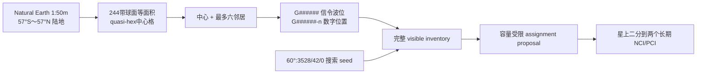

# ±57°全球陆地星载双小区与波位规划

> 本文把全球地固两级波位、星载双小区和轨道搜索连接起来。当前只整理文档与 Web seed，不修改 CU-CP、F1AP、DU、MAC、PHY、RU、C++ API 或运行配置。旧中国 2,620 L1 / 18,208 L2 和 `53°:720/30/1` 只作为历史样例。

## 1. 规划结论

- 服务范围是南纬 `57°` 至北纬 `57°` 的全球陆地，不包含海洋和更高纬度。
- 地面只固定全球 `G` 系列 `position_id`、几何和邻接，不预制地固 NR 小区。
- 每颗卫星运行两个长期星载 NR 小区；NCI/PCI 属于小区，不属于波位。
- 轨道搜索从 `Walker Delta 60°:3528/42/0` 开始；该 seed 已在 `t=0` coarse snapshot 失败，同规模 `F=1` 只有不可选择的 coarse 证据，`selectedScenario=null`。
- 每星资源 seed 为 `32 analog / 128 digital`，两个小区各 `16/64`，暂不跨小区借用。
- 当前离散日历在任意 80 ms 窗口的最差相位仍能保证每小区 128 个 L1、每星 256 个 L1；这是日历硬保证，不是平均/最佳相位上限。PRACH 重访目标是 640 ms。
- 每个 L1 的完整 `visible inventory` 永不被 128/256、active 或 loaded 上限裁剪。

## 2. 全球两级波位目录

Web 已用本地 Natural Earth 4.1.0 / `world-atlas@2.0.2` 的 `1:50m` land 数据，在 `57°S～57°N` 生成全球目录。算法使用 244 个等 `sin(latitude)` 纬度带，将每个纬度带按经度等分为球面等面积单元，并交错排列为 quasi-hex 中心格；陆地判定采用中心点包含。

生成结果为 `36,411` 个 L1、`249,375` 个有效 L2，其中 `33,871` 个 full L1、`2,540` 个 edge L1。目标球面单元面积为 `3,117.691454 km²`，最大面积偏差 `0.1115%`；cells SHA-256 为 `b39fe9c3ee9a9355b3546036b7f16e0fb858c953f8558cc4295122f2169fbe7a`。

实现入口：

- 生成与 `--check`：[`../web_replicas/ntn_beam_planner/scripts/generate-global-land-catalog.mjs`](../web_replicas/ntn_beam_planner/scripts/generate-global-land-catalog.mjs)
- 紧凑目录：[`../web_replicas/ntn_beam_planner/public/data/global-land-l1-v1.json`](../web_replicas/ntn_beam_planner/public/data/global-land-l1-v1.json)
- 本地数据源：[`../web_replicas/ntn_beam_planner/public/data/land-50m.json`](../web_replicas/ntn_beam_planner/public/data/land-50m.json)
- focused tests：[`../web_replicas/ntn_beam_planner/tests/beam-catalog.test.mjs`](../web_replicas/ntn_beam_planner/tests/beam-catalog.test.mjs)，目录测试 `6/6` 通过。

边界必须如实保留：`equalAreaGrid=true`，但 `exactRegularSphericalHexagons=false`、`exactCoastlineClipping=false`。因此它是面积受控的球面 quasi-hex 中心格，不是严格正球面六边形；海岸按中心点纳入，不是对格网多边形做精确海岸裁剪。该 Web 目录仍不是正式运营 GIS 冻结成果。

## 3. 全球 `G` 编号

| 对象 | 规范 seed | 示例 | 说明 |
|---|---|---|---|
| L1 信令波位 | `G######` | `G000001` | 纬度降序、同带经度升序生成，全球稳定 |
| L2 数字波位 | `<L1>-n` | `G000001-0`～`G000001-6` | 仅为 `childMask` 有效位生成；通过父 L1 继承服务小区 |
| L2 局部槽位 | `0～6` | `3` | 父 L1 内位置；与父 ID 合并后才是全球 ID |
| 卫星短号 | `Pxx-Sxxx` | `P07-S041` | 轨道目录键，不编码 NCI |

ID 不编码经纬度、国家、卫星或 NCI。具体几何保存在目录字段中；`childMask` 决定七个局部槽位中的有效 L2。旧 `A####`、`CN1.*` ID 仅用于历史 Web 数据兼容，不进入全球主目录。

## 4. NCI 与 PCI

NCI 是管理中心 registry 分配的 opaque 36-bit planning ID，在 PLMN 内唯一；NCGI 由 PLMN identity 与 NCI 组合后全球唯一。每星两个长期小区各持有一个 NCI。若最终选择 3,528 星，需要 7,056 个 NCI，但最终数量随 `selectedScenario` 变化。NCI 不从卫星短号、`G` 波位 ID 或坐标推导，也不需要 `onboard_cell_index` 或 `SatelliteCellBinding`。

PCI 只有 1,008 个值，必须复用。规划方法是：

1. 在事件驱动时间轴上，找出所有同时可见且同频的星载小区对。
2. 将每个长期星载小区作为图节点，把这些小区对连接为冲突边。
3. 在冲突图上分配/复用 PCI，并对 7 天时间并集及关键失效场景复查。
4. PCI 与长期星载小区绑定，不因每次跳波束访问或 L1 ownership 改变而改变。

任何“零 PCI 冲突”结论都必须引用具体图版本、频率复用假设和时间范围；旧中国六边形一跳代理不能替代全球冲突图。

## 5. 四层状态不能混用

### 5.1 固定目录

全球 `G######` / `G######-n` 目录只保存地固 ID、几何、邻接、mask 分类和 deadline，不保存永久 NCI/PCI。

### 5.2 完整 visible inventory

- 新候选在对应 L1 仰角达到 `45°` 后进入。
- 当前 owner 可滞回保持到 `42°`。
- 保存所有满足几何与外部可用条件的卫星，不受每星 256、每小区 128、active L1 或 loaded L2 上限裁剪。

### 5.3 Assignment proposal

容量匹配从完整 visible inventory 中选择每个 L1 的 desired owner。每个 L1 在同一 epoch 至多一个 primary；未分配必须显式报告，不能通过删除波位、裁剪候选或放宽门限获得绿色结果。

### 5.4 Actual serving

proposal 只有在目标表版本完整、资源 ready、DU `applied` 且到达对齐 640 ms 的 activation epoch 后才成为 actual serving。target prepared/overlap 不是第二个 primary。

## 6. 星上两个小区怎样形成

管理中心先给卫星下发获授权 L1 集合，星载 gNB 再把集合二分到两个长期 NCI/PCI。二分优先级为：

1. 每个小区不超过派生日历容量。
2. 已接入 UE 尽量 sticky，避免无意义跨小区重分组。
3. 兼顾地理紧凑、邻接连通和负载平衡。
4. 资源冲突时明确拒绝或降额，不临时创造 NCI。

空间紧凑和连通当前只是优化目标，不得写成已证明硬保证。L1 从一个小区重新分到另一个小区时，UE 看到的是小区关系变化；connected UE 需要 HO/CHO，idle UE 需要重选或重新接入。

## 7. `128/256` 容量 seed 从哪里来

`128/256` 不是协议常量、天线硬件常量或同时点亮数量。它是当前离散日历在所有三相位起点下都满足的配置硬保证：

1. L1 SSB 重访目标为 `80 ms`。
2. 每个小区每 `20 ms` 有一次 SSB occasion，因此 80 ms 内有 4 次；两个小区在 10 ms slot 上交错。
3. 三相位模拟 DL/UL 端口数为 `11/5、11/5、10/6`。
4. 每个 DL 端口在 10 ms access slot 内完成 4 次顺序 `2.5 ms` L1 子访问。
5. 任意 80 ms 对齐的最差相位仍有 42 个 DL port-occasion，即 `42 × 4 = 168` 次访问机会。
6. 配置容量取 `min(168, 128) = 128` 个 L1/小区，因此两小区合计 256；128/256 是当前模型的最差相位硬保证，而不是可用机会的理论上限。

这个硬保证只在当前离散日历与 2.5 ms retarget seed 内成立，尚未证明真实 PHY/RU/RF 能实现，也未完成切换 guard、功率、带宽、SIB、Paging、RAR、波束指向速度和上行 PRACH 的工程复核。数字 64/128 是端口规划上限，不参与 SSB 容量公式，也不能据此声称 128 路数字波束可以同时满功率发射。

PRACH 重访目标为 640 ms；每个广播 RO 必须有对应上行接收波束。SSB 可行不自动证明 PRACH、RAR、TA 或 Doppler 可行。

## 8. 轨道怎样约束波位 ownership

搜索 seed 使用 500 km、`60°:3528/42/0`、`45°/42°`。对每个事件区间至少记录：完整 visible inventory、assigned L1、每星/每 NCI 负载、失败位置、owner 变化、PCI 冲突、SSB/PRACH deadline 和 N-1 状态。

当前 coarse 结果已经足以排除 `F=0` seed，但还不能选中 `F=1`：

| 场景 | coarse 结果 | 规划含义 |
|---|---|---|
| `60°:3528/42/0`，`t=0` | 23 个 L1 无 45° 候选，峰值 `206/256`，0 星溢出 | seed 明确失败，不可 selected |
| `60°:3528/42/1`，`t=0` | 0 空窗，最少候选 1，峰值 `207/256`，0 星溢出 | 仅单 epoch 证据 |
| `60°:3528/42/1`，一天/120 s | `720/720` 离散 epoch 无空窗，最少候选 1，峰值 `209/256`，溢出 epoch 0 | coarse 固定步长结果，不证明采样间连续性 |

报告为 [`F=0 snapshot`](../web_replicas/ntn_beam_planner/app/global-constellation-snapshot.json)、[`F=1 snapshot`](../web_replicas/ntn_beam_planner/app/global-constellation-f1-snapshot.json) 和 [`F=1 one-day coarse`](../web_replicas/ntn_beam_planner/app/global-constellation-f1-day-coarse.json)。[`audit-global-constellation.mjs`](../web_replicas/ntn_beam_planner/scripts/audit-global-constellation.mjs) 及 focused CLI tests [`2/2`](../web_replicas/ntn_beam_planner/tests/global-constellation-audit-cli.test.mjs) 已有测试覆盖。

[`global-constellation-audit.json`](../web_replicas/ntn_beam_planner/app/global-constellation-audit.json) 仍明确记录 `selectedScenario=null`、exact audit `status=not_run`。coarse 报告为 `auditLevel=coarse`、`exact=false`，无权写入 selected scenario；不得出现“推荐星座已通过”“全球连续零空窗”或“PCI 已验证”等表述。

## 9. 当前完成度

状态统一为 `规划中`、`已实现`、`已有测试覆盖`、`已有运行态证据`：

| 能力 | 状态 | 证据边界 |
|---|---|---|
| 旧中国 L1/L2 目录和 Web 交互 | 已有测试覆盖 | 只覆盖历史 2,620 / 18,208 样例 |
| 全球目录生成器、紧凑 asset 与 loader | 已实现 | Web 已生成 36,411 L1 / 249,375 L2；不等于 CU-CP 运行实现 |
| 全球目录确定性、land containment、面积与完整性 | 已有测试覆盖 | `catalog:check` 与 focused 目录测试 `6/6` 通过；不是正式运营 GIS 验收 |
| `60°:3528/42/0` 搜索 seed | 已实现 | 参数与 snapshot 存在；`t=0` 有 23 个空窗，明确不可 selected |
| 全球 coarse 轨道 audit CLI 与报告 | 已有测试覆盖 | CLI tests `2/2`；F=0 失败，F=1 一天 720/720 仍非连续证明 |
| 两个长期星载 NCI/PCI registry 与 PCI proxy 图 | 已有测试覆盖 | Web 生成 7,056 个唯一 36-bit NCI；59,976 条局部 Walker proxy 边用 8 个 PCI 着色且冲突为 0；不是连续可见性或 RF 图 |
| 完整 visible inventory 与 128/256 容量检查 | 已有测试覆盖 | inventory 不裁剪；F=1 一天 coarse 报告峰值 209/256、超限 epoch 为 0；尚无 7 天事件驱动证明 |
| Web 80/640 ms deadline 日历 | 已有测试覆盖 | idle L1 SSB、PRACH 与 UL beam 对应关系有 focused tests；不是 PHY/RU 运行证据 |
| N-1、真实 PCI 干扰、PHY/RU/RF | 规划中 | 尚无运行态证据 |

## 10. 历史对照

旧 `53°:720/30/1`、大陆及海南 2,620 L1、18,208 L2、`25°/22°`、每星 84 和 24 小时/120 s 审计均保留为历史中国样例。其 `720/720` 离散快照、PCI 一跳代理与 owner diff 不适用于全球目标，也不是连续时间、事件驱动、N-1 或 RF 证明。

## 11. 下一步

1. 以已生成的 `G######` / `G######-n` Web 目录为仿真输入，另行评审正式运营 GIS、海岸精确裁剪和版本冻结。
2. 参数化扫描 Walker 面数、每面星数、倾角、`F`、RAAN 和相位偏置。
3. 运行至少 7 天事件驱动精确审计，并加入每星容量降额、gateway 和 N-1。
4. 构建全球星载小区 PCI 冲突图，验证 1,008 个 PCI 的复用。
5. 报告经评审后才填写 `selectedScenario`，再评审运行态接口。
