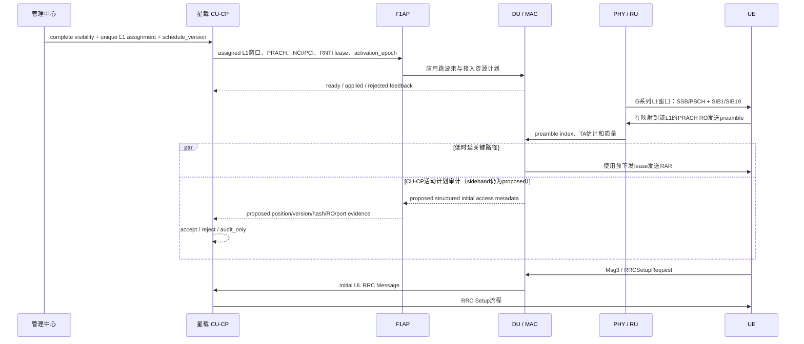

# NTN 全球“跳波束”与初始接入设计

> 跳波束是星载再生 gNB 按版本化日历，在实际分配给本星的全球地固 L1 之间周期切换模拟波束：模拟波束承载 SSB/PBCH、SIB1/SIB19、Paging 和初始接入窗口，数字波束按业务需求照射 L2。离线规划已经把“完整可见清单”和“实际负责结果”分开；现有 CU-CP 私有输入仍只有一份 `visible_l1_positions`，并会把其中全部 L1 划入两个小区，因此尚不能同时接收这两份集合。当前代码已实现 CU-CP 版本化双小区计划、完整 inventory、日历 dry-run、原子激活，以及默认关闭的 DU/MAC SSB/PRACH 软件 gate；双集合输入、真实 `position_id`/`port_id` 指向和 PHY/RU/RF 执行仍未实现。

## 1. 一句话定义

跳波束不移动地面波位，也不让 NCI 跟着波位走；它决定某个时刻由哪个长期星载小区、哪个模拟或数字端口照亮哪个全球 `G` 系列 `position_id`。

- `G######` L1 与 `G######-n` L2 的 ID、几何和邻接地固。
- 每颗卫星有两个长期星载 NCI/PCI；NCI/PCI 随小区移动，不随 L1 跨星迁移。
- 即使没有 UE，active L1 也必须按 80 ms 目标重访 SSB。
- L2 只有存在 PDU/DRB 需求且 DU 已返回 `applied` 时才进入数字服务。
- 每个 L1 的完整 `visible inventory` 不受 active、loaded、每小区 128 或每星 256 上限裁剪。
- 管理中心离线 actual assignment 在完整清单上为每个 L1 选择且只选择一个负责卫星；128/小区、256/星只约束实际负责的 L1，不是波束数量。该结果尚未通过独立字段接入 CU-CP。
- PRACH 按每个已分配 L1 安排；某卫星仅在清单中“可见”该 L1，不等于该卫星应为它安排 PRACH。

## 2. 全球与轨道 seed

当前目标是 `57°S～57°N` 全球陆地、500 km、候选/退出仰角 `45°/42°`。最终方案采用 46×65、共 2,990 颗卫星，比 42×84、3,528 颗历史展示对照少 538 颗，即减少 15.25%。一天/120 s 报告在 720/720 个离散时刻同时得到 `coverage=true` 和 `assignment=true`。固定步长采样仍不证明采样间连续覆盖；`selectedScenario=null`、`exact=false` 表示上线验收尚未完成，不再表示卫星数量没有结论。

旧 `53°:720/30/1`、大陆及海南 2,620 L1 和 24 小时/120 s 离散审计只作为历史中国样例。

## 3. 模拟波束承载什么

模拟信令波束至少承载：

- `SSB/PBCH`：同步、PCI 和 MIB。
- `SIB1`：公共小区和 RACH 配置。
- `SIB19`：NTN 星历、common TA 和网络辅助信息；它是小区/波束网络状态，不依赖单个 UE capability。
- `Paging`：空闲/非激活 UE 的唤醒机会。
- `PRACH` 接收窗口和 `RAR` 下行机会。

所以没有 UE 不等于可以关闭 L1。可以按业务关闭的是按需 L2 数字服务，不是网络级发现和接入信令。

## 4. 资源与时序 seed

| 资源/时序 | 每星载小区 | 每颗卫星 | 说明 |
|---|---:|---:|---|
| analog 端口 | `16` | `32` | 两个小区暂不互借 |
| digital 端口 | `64` | `128` | 端口上限不等于同时满功率波束数 |
| L1 SSB 重访目标 | `80 ms` | `80 ms` | 无 UE 也必须满足 |
| L1 PRACH 重访目标 | `640 ms` | `640 ms` | 每个有效 RO 必须配对应 UL 波束 |
| actual assignment L1 上限 | `128` | `256` | 只限制实际负责 L1；不是波束数，也不裁剪 visible inventory |

16 路模拟端口不是永久 DL 或 UL 端口；具体 TDD 相位应由真实 band、SCS、SSB 与 PRACH 映射共同生成。日历必须明确每个端口在每个子访问中的方向，禁止同一时刻重复占用。表中的整星 128 个 digital 端口与每小区最多 128 个 assigned L1 是两个不同维度，不能互相解释为“128 个波束”。

### 4.1 为什么 actual assignment 上限取 128/256

1. 每小区每 `20 ms` 有一次 SSB occasion，两个小区在 10 ms access slot 上交错。
2. 三相位模拟 DL/UL 端口数为 `11/5、11/5、10/6`。
3. 每个 DL 端口在 10 ms access slot 内完成 4 次顺序 `2.5 ms` L1 子访问。
4. 80 ms 包含 4 次该小区的 occasion；任意起始相位的最差 DL port-occasion 和为 42。
5. 最差窗口因此有 `42 × 4 = 168` 次访问机会；actual assignment 的配置容量取 `min(168,128)=128` 个 L1/小区，两小区合计 256。

因此 128/256 是当前离散日历模型和 CU-CP 执行包络允许实际负责的 L1 数，不是平均值、最佳相位、可见候选数或物理波束数。离线规划必须完整保存 visible inventory，再由唯一分配计算本星实际负责的子集；每个已分配 L1 都要获得 SSB 与 PRACH 机会。现有 CU-CP 尚未实现“双集合”输入，它仍会对 `visible_l1_positions` 中的全部 L1 做容量校验和双小区划分，因此不能把负责子集冒充为完整清单，也不能声称这一离线结果已经进入 C++ 运行态。这个保证仍依赖 2.5 ms retarget 和抽象端口模型；guard、功率、带宽、SIB、Paging、RAR、PRACH 与实际射频指向必须由 PHY/RU/RF 复核。它不是 3GPP 或载荷硬件常量。

### 4.2 日历条目

```text
BeamScheduleEntry
  satellite_id
  nci
  pci
  position_id       // G###### 或 G######-n
  start_time
  duration
  direction         // downlink / uplink
  beam_class        // analog / digital
  port_id
  purpose           // SSB / SIB / Paging / PRACH / RAR / service
  schedule_version
  activation_epoch
  state             // proposed / ready / applied / active / released
```

目标契约是：管理中心生成星历、全球波位表、完整 visible inventory、与之分离的 unique assignment proposal、NCI registry、PCI 规划、版本和 activation epoch；星载 CU-CP 不运行全球选星算法，只校验本星输入并把实际负责的 L1 划给两个长期小区。当前 C++ schema 只有 `visible_l1_positions`，无法同时表达完整清单与负责子集，这一私有输入契约仍待扩展；在此之前，网页的唯一分配和 PRACH 日历只是离线规划结果。

## 5. 一个 L1 的跳波束接入时序

下面是目标时序，不表示双集合输入和真实波束控制已经接通：



CU-CP 统一管理每个已分配 L1 的 PRACH 日历和接入资格，不代表把采样、相关检测或 RAR 的硬实时路径搬进 CU-CP。PHY 检测，DU/MAC 保证时序，CU-CP 管理日历、lease、接入资格和审计。

## 6. PRACH 到 CU-CP 的责任边界

| 层次 | 正确责任 |
|---|---|
| 卫星/RU/PHY | 对准 G 系列 L1、接收 PRACH、相关检测，输出 preamble index、TA 和质量估计 |
| DU/MAC | 处理同一 RO 冲突、从 CU-CP 预下发 lease 取临时 RNTI、按时发送 RAR |
| F1AP | 当前传递标准 Initial UL 与既有 applied feedback；完整结构化接入事件仍是 proposed private sideband |
| CU-CP | 管理日历、接入资格、RNTI lease、速率限制、异常审计和最终 RRC 接入 |

完整 sideband 方案应让 CU-CP 看到 `satellite_id`、`nci/pci`、全球 L1 `position_id`、catalog/schedule version、source/calendar hash、实际 RO/端口、preamble、TA/质量和 RNTI lease。当前标准 Initial UL 只提供 CGI/C-RNTI/RRC container，不能证明 `position_id` 或 PRACH RO。CUCP-037 已提供私有纯审计器，可对完整测试输入返回 `accept/reject/audit_only`，但未接入生产 F1AP，也不使用旧 beam-to-NCI 路径猜测 L1。

CUCP-038 另行修复周期性资源审计的 fail-safe 语义。旧的一秒 DU audit
可能返回 `accepted=true` 与空 snapshot；CU-CP 若把“未提供”当成“确认不
存在”，会产生虚假 resend/apply/clear repair。私有 audit codec v2 因此按
域增加 `rnti_snapshot_complete` / `ue_slot_snapshot_complete`，v1 解码时两域
均为 incomplete。只有 complete 域里的缺失才允许触发 repair。

MAC 为每个 cell 保留 `pending -> consumed_by_mac -> expired` lease ledger，
执行下发的 `expiry_ms`，在 replace 前先刷新过期状态，原子替换并保留
terminal history；同 generation 的 add 重试是 no-op，不延长 expiry，也不复活
consumed/expired 状态。`allocate_for_cell` 在同一把锁内选择 NTN 或 terrestrial
路径。同一 DU 的 RNTI table 是扁平的，因此两个 cell 即使 key 含 cell identity，
也不能复用同一个 C-RNTI 值；不同 DU 可以复用。尚未 `add_ue` 的 terrestrial
TC-RNTI 会记录 10 秒，以便首次并发 NTN update 拒绝碰撞；NTN 未激活时该记录
不参与 terrestrial 选择，因此原有 RNTI 序列不变，但同步开销并非性能等价证明。

DU 校验 gNB-DU、完整 NCGI、PCI 和 snapshot cell 后返回带逐项 generation 的
真实 RNTI snapshot。lease ACK 必须 generation 和完整 accepted/rejected 集合同时
匹配；缺失、残缺、重复或矛盾的 ACK 记为 `ack_unknown`，随后只以原 generation
修复。普通 in-flight pool 等待 ACK，并阻止低水位逻辑叠加新 generation。CU-CP
据此提升匹配 pending 证据、对齐 consumed/expired 状态，不重发已被 MAC 消费、
已见 Initial UL、已 committed 或已 expired 的旧 lease。明确 audit reject 会进入
可观测 conflict；同 target 后续 accepted complete audit 可解除 generic blocker。
当前 DU 缺少可靠的
CU-global UE identity 映射，所以 UE SR/SRS slot snapshot 明确保持 incomplete，
不能用空列表修复该域。SR/SRS repair 成功时保存 DU 实际 `applied_request`，避免
DU 调整 offset/period 后反复产生同一 mismatch。

这份 audit 只证明 MAC/DU software state，不证明 RAR 已发射、原始 PRACH 已
检测或 Initial UL 携带可信 `position_id`，也不是 PHY/RU/RF telemetry。DU
connection epoch、authentication、freshness/anti-replay 和 UE-slot identity
mapping 仍需后续闭环；terminal history GC/RNTI reuse policy 也尚未冻结。
完整 snapshot 查找已索引化以避免 O(N²) 比较，但未做 endurance 验证；在没有
terminal history GC/RNTI reuse policy 前，不能声称长期运行不会耗尽 C-RNTI。
codec v2 要求 CU/DU 同版本部署，v1 兼容仅指新 CU 的 fail-safe 解码。SIB19
feedback 也校验 request/current generation、in-flight state 和 update/clear 精确
结果；production DU FIFO 保证完整 completion 顺序，但较小 generation 的应用层
重放尚未由 DU high-water mark 拒绝。

## 7. PRACH 参数起点

每个当前星载小区/接入配置可以先用 64 个 preamble 做仿真起点：48 个 contention-based、8 个 CFRA/dedicated、8 个保护预留。这个拆分不是协议定案，也不能永久绑定到每个 L1。

| 参数 | seed 建议 | 边界 |
|---|---|---|
| `preambleTransMax` | `n10` | 仍需真实链路与碰撞统计调整 |
| `powerRampingStep` | `dB4` 起步 | 需要链路预算验证 |
| RAR response budget | 不超过 80 ms L1 重访预算 | 包含 timing offset、DU 处理和下一 DL 窗口 |
| collision backoff | 随机退避 1～2 个 L1 重访周期 | 防止下一窗口同步重发 |

L1 的 SIB19 必须在 PRACH 前可获得且未过期。缺失有效星历或 UE 位置时，不能把 PRACH 失败简单归因于拥塞。

## 8. NCI/PCI 与跨星接管

NCI 属于长期星载小区。L1 跨星时 position_id 不变，服务 NCI/PCI 改为目标星小区的身份；这不是 NCI 迁移。目标 ready/applied 前，源侧仍是唯一 primary。

PCI 必须按同时可见、同频星载小区冲突图复用：节点是长期星载小区，冲突边来自至少 7 天事件驱动可见性及频率计划。PCI 不随波位跳变；旧中国一跳邻接 proxy 不能证明全球 RF 安全。

## 9. L2 数字波束

L2 只有存在 PDU/DRB demand 且 applied 后才调度；`control_only` UE 不占 L2。每小区固定 64 路数字资源，两个小区暂不互借；`4 DL + 2 UL` 可继续作为有业务时的低负载 seed，之后按需求和功率预算扩展。整星 128 是端口规划上限，不是 128 路同时满功率承诺。

数字业务必须为已承诺的 L1 SSB、PRACH、RAR 和 Paging 窗口让路；未 applied 的 L2 不能标为 ready。

## 10. 硬不变量

1. 全球地固对象使用 `G######` / `G######-n` ID；波位不拥有永久 NCI/PCI。
2. 每颗卫星有两个长期星载小区；每小区 `16/64`、整星 `32/128`，暂不互借。
3. 完整 `visible inventory` 不受 128/256、active 或 loaded 上限裁剪。
4. actual assignment 为每个 L1 选择一个负责方；128/小区、256/星只限制实际负责 L1，不是波束数量。
5. 新选/退出门限为 `45°/42°`；容量只影响 assignment，不反向改变可见性。
6. 即使没有 UE，每个已分配 active L1 仍满足 80 ms SSB 重访。
7. PRACH 按每个已分配 L1 安排；每个有效 PRACH RO 都必须有对应 UL 波束，目标重访不超过 640 ms。
8. NCI/PCI 属于星载小区，不随 L1 跨星迁移；PCI 按冲突图复用。
9. 同一 L1 每个 epoch 最多一个 primary；proposal 未经 ready/applied/activation gate 不是 serving。
10. 数字 L2 仅由 PDU/DRB demand 驱动，且 applied 后才 ready。
11. NTN 扩展不得改变 terrestrial 默认路径。

## 11. 精确审计与状态

2,990 颗最终方案必须运行至少 7 天事件驱动验收，精确捕获 `45°/42°` 穿越、容量饱和、ownership 变化、PCI 冲突、SSB/PRACH deadline、gateway 和 N-1 事件。网页 3,528 颗模型仅为历史展示对照；当前 `selectedScenario=null`、`exact=false` 表示连续验收记录尚未完成。

2,990 颗最终方案已经完成一天/120 s 的 720 个离散时刻检查：

| 证据层 | 720 个采样点结果 | 边界 |
|---|---|---|
| 完整 visible inventory | `coverage=true`、最大未覆盖 `0`、最少 entry 候选 `2`、release-visible 峰值 `254/星`、entry-visible 峰值 `209/星` | 是完整几何候选统计，不是负责量 |
| actual unique assignment | `assignment=true`、`conclusive=720/720`、实际负责峰值 `87/星`、平衡双小区峰值 `44/小区`、overflow `0` | 只证明每个采样点存在容量内唯一分配 |

这两行不能合并解读：254/209 是某星在完整清单里可见的 L1 峰值，87/44 才是实际负责量。报告仍为固定步长、`exact=false`；采样间可能存在几何空洞、分配失败或 ownership 事件，因此不能写成“全球连续覆盖通过”。

统一使用五级状态：`规划中`、`已实现`、`已有测试覆盖`、`已有离线规划证据`、
`已有运行态证据`。管理中心工具或网页生成的报告属于离线规划证据，不等同于
C++ 基站运行日志、pcap 或空口证据。

| Web/运行能力 | 状态 | 证据边界 |
|---|---|---|
| 全球目录生成器、asset 与 loader | 已实现 | Natural Earth 1:50m 生成 36,411 L1 / 249,375 L2；不是 CU-CP 运行态 |
| 全球目录一致性 | 已有测试覆盖 | `catalog:check` 与 focused 目录测试 `6/6` 通过；`exactRegularSphericalHexagons=false`、`exactCoastlineClipping=false` |
| actual assignment 128/256 日历包络 | 已有测试覆盖 | 最差 80 ms 日历 168 次机会、配置取 128 assigned L1/小区；不是波束数或 PHY/RU/RF 证明 |
| 2,990 颗最终方案的一天 coarse 报告 | 已有离线规划证据 | 已采用为最终工程方案；目录内容 hash 已重新校验，120 s 的 coverage 与 unique assignment 均为 720/720，actual 峰值 87/星、44/小区、overflow 0；公共 epoch 尚未冻结，仍非连续证明，也不是 C++ 运行态证据 |
| 完整可见清单 + 实际负责子集输入 | 规划中 | 当前 CU-CP 只有 `visible_l1_positions` 且会全部划入小区；双集合私有契约尚未实现 |
| CU-CP 双小区版本化计划与日历 dry-run | 已有测试覆盖 | 保留完整 inventory、确定性划分、80/640 ms 审计、257 L1 显式 overflow、activation epoch 原子切换；不是全球覆盖证明 |
| DU/MAC SSB/PRACH 软件 gate | 已有测试覆盖 | `applied` 仅表示匹配 version/hash/intents 的软件 snapshot；不含 position/port 或 RF evidence |
| Initial UL active-plan audit | 已有测试覆盖 | 私有纯函数验证完整 sideband 测试输入；生产 F1AP transport、可信 provenance 与 RF evidence 均未实现 |
| DU/MAC RNTI resource audit | 已有 focused 测试覆盖 | codec v2 区分 RNTI/UE-slot 完整性；ACK 原子校验、同 generation repair、真实 lease ledger 和可恢复 audit conflict 已闭环；resource-manager 39/39、RNTI manager 23/23 通过，UE-slot 域仍 incomplete；不是 endurance、RAR/PRACH/RF 证据 |
| 轨道精确审计、PCI 冲突图和实际跳波束 | 规划中 | `selectedScenario=null`、`exact=false`，7 天事件审计尚未完成 |

需要重点观测：

| 指标 | 目标用途 |
|---|---|
| `visible_candidate_count_per_l1` | 完整 visible inventory 是否保留 |
| `assigned_l1_per_satellite` | actual assignment 是否超过每星 256；不统计完整可见清单 |
| `assigned_l1_per_nci` | actual assignment 是否超过每小区 128；不代表波束数 |
| `l1_ssb_deadline_miss` | 80 ms SSB 重访是否失败 |
| `prach_ro_without_beam` | 每个已分配 L1 的有效 RO 是否缺 UL 波束，必须为 0 |
| `prach_deadline_miss` | 每个已分配 L1 的 640 ms PRACH 重访是否失败 |
| `pci_conflict_interval` | 冲突图相邻小区是否复用 PCI |
| `duplicate_primary_owner` | 同一 L1 是否有两个 primary，必须为 0 |
| `ownership_change_event` | 带滞回/冻结/代价后的 proposal 变化，不直接当 HO |

## 12. 下一步与声明边界

1. 以已生成的 36,411 L1 / 249,375 L2 Web 目录做仿真输入，另行冻结正式运营 GIS 与精确海岸裁剪。
2. 以 46×65、2,990 颗作为最终工程方案继续验证；3,528 颗仅保留为历史网页展示对照。
3. 为 CU-CP 增加最小私有双集合契约：完整可见清单用于审计，实际负责子集用于两个小区和日历；不得用一个字段冒充两者。
4. 对 actual assignment 的 128/256 做 guard、功率、带宽、公共信令和 PRACH 降额，不裁剪完整可见清单。
5. 冻结公共 epoch，运行至少 7 天事件驱动、gateway 和 N-1 审计。
6. 生成全球 PCI 冲突图；7 天验收通过后填写 `selectedScenario` 审计记录。

`80/640 ms`、20 ms occasion、2.5 ms sub-visit、`16/64`、`n10` 和 `48/8/8` 都是规划参数。128/256 只限定 actual assignment 中每小区/每星实际负责的 L1，是当前离散日历模型和 CU-CP 执行包络，不是波束数或协议常量。srsRAN 当前已实现单集合的管理中心版本化输入、两个稳定星载 NCI/PCI、输入集合的双小区划分与软件日历 gate；尚未实现完整可见清单与负责子集的双集合输入、全球连续覆盖证明、可信 Initial UL position sideband、模拟端口到硬件句柄映射或真实 PHY/RU/RF 跳变，因此这些能力仍不能标为 C++ 或 RF 运行态证据。
