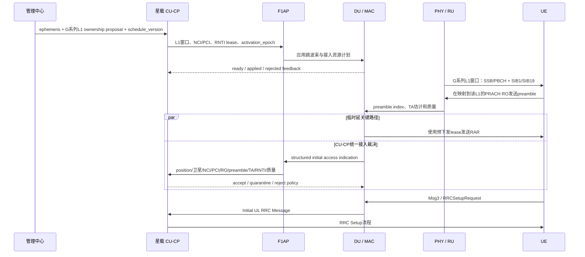

# NTN 全球“跳波束”与初始接入设计

> 跳波束是星载再生 gNB 按版本化日历，在获授权的全球地固 L1 之间周期切换模拟波束：模拟波束承载 SSB/PBCH、SIB1/SIB19、Paging 和初始接入窗口，数字波束按业务需求照射 L2。本轮只修改文档与 Web seed，不修改 C++、CU-CP、F1AP、DU、MAC、PHY、RU、API、协议容器或运行配置。

## 1. 一句话定义

跳波束不移动地面波位，也不让 NCI 跟着波位走；它决定某个时刻由哪个长期星载小区、哪个模拟或数字端口照亮哪个全球 `G` 系列 `position_id`。

- `G######` L1 与 `G######-n` L2 的 ID、几何和邻接地固。
- 每颗卫星有两个长期星载 NCI/PCI；NCI/PCI 随小区移动，不随 L1 跨星迁移。
- 即使没有 UE，active L1 也必须按 80 ms 目标重访 SSB。
- L2 只有存在 PDU/DRB 需求且 DU 已返回 `applied` 时才进入数字服务。
- 每个 L1 的完整 `visible inventory` 不受 active、loaded、每小区 128 或每星 256 上限裁剪。

## 2. 全球与轨道 seed

当前目标是 `57°S～57°N` 全球陆地、500 km、候选/退出仰角 `45°/42°`。`Walker Delta 60°:3528/42/0` seed 在 `t=0` coarse snapshot 已有 23 个 L1 无 45° 候选，明确失败；同规模 `F=1` 一天/120 s coarse 虽有 `720/720` 离散 epoch 无空窗，仍不证明采样间连续覆盖。`selectedScenario=null`、exact audit `not_run`。

旧 `53°:720/30/1`、大陆及海南 2,620 L1 和 24 小时/120 s 离散审计只作为历史中国样例。

## 3. 模拟波束承载什么

模拟信令波束至少承载：

- `SSB/PBCH`：同步、PCI 和 MIB。
- `SIB1`：公共小区和 RACH 配置。
- `SIB19`：NTN 星历、common TA 和网络辅助信息；它是小区/波束网络状态，不依赖单个 UE capability。
- `Paging`：空闲/非激活 UE 的唤醒机会。
- `PRACH` 接收窗口和 `RAR` 下行机会。

所以没有 UE 不等于可以关闭 L1。可以按业务关闭的是按需 L2 数字服务，不是网络级发现和接入信令。

## 4. 资源与时序 seed

| 资源/时序 | 每星载小区 | 每颗卫星 | 说明 |
|---|---:|---:|---|
| analog 端口 | `16` | `32` | 两个小区暂不互借 |
| digital 端口 | `64` | `128` | 端口上限不等于同时满功率波束数 |
| L1 SSB 重访目标 | `80 ms` | `80 ms` | 无 UE 也必须满足 |
| L1 PRACH 重访目标 | `640 ms` | `640 ms` | 每个有效 RO 必须配对应 UL 波束 |
| L1 日历硬保证 | `128` | `256` | 80 ms 最差相位有 168 次机会，配置上限取 128/小区 |

16 路模拟端口不是永久 DL 或 UL 端口；具体 TDD 相位应由真实 band、SCS、SSB 与 PRACH 映射共同生成。日历必须明确每个端口在每个子访问中的方向，禁止同一时刻重复占用。

### 4.1 为什么 128/256 是当前日历硬保证

1. 每小区每 `20 ms` 有一次 SSB occasion，两个小区在 10 ms access slot 上交错。
2. 三相位模拟 DL/UL 端口数为 `11/5、11/5、10/6`。
3. 每个 DL 端口在 10 ms access slot 内完成 4 次顺序 `2.5 ms` L1 子访问。
4. 80 ms 包含 4 次该小区的 occasion；任意起始相位的最差 DL port-occasion 和为 42。
5. 最差窗口因此有 `42 × 4 = 168` 次访问机会；配置容量取 `min(168,128)=128` 个 L1/小区，两小区合计 256。

因此 128/256 是当前离散日历模型对所有相位对齐的硬保证，不是平均值、最佳相位或 168 次机会的同义词。这个保证仍依赖 2.5 ms retarget 和抽象端口模型；guard、功率、带宽、SIB、Paging、RAR、PRACH 与实际射频指向必须由 PHY/RU/RF 复核。它不是 3GPP 或载荷硬件常量。

### 4.2 日历条目

```text
BeamScheduleEntry
  satellite_id
  nci
  pci
  position_id       // G###### 或 G######-n
  start_time
  duration
  direction         // downlink / uplink
  beam_class        // analog / digital
  port_id
  purpose           // SSB / SIB / Paging / PRACH / RAR / service
  schedule_version
  activation_epoch
  state             // proposed / ready / applied / active / released
```

管理中心下发星历、全球波位表、完整 visible inventory/ownership proposal、NCI registry、PCI 规划、版本和 activation epoch。星载 gNB 必须拒绝过期、缺页、校验失败或资源越界的日历。

## 5. 一个 L1 的跳波束接入时序



CU-CP 统一处理 PRACH 信息，不代表把采样、相关检测或 RAR 的硬实时路径搬进 CU-CP。PHY 检测，DU/MAC 保证时序，CU-CP 管理日历、lease、接入资格和审计。

## 6. PRACH 到 CU-CP 的责任边界

| 层次 | 正确责任 |
|---|---|
| 卫星/RU/PHY | 对准 G 系列 L1、接收 PRACH、相关检测，输出 preamble index、TA 和质量估计 |
| DU/MAC | 处理同一 RO 冲突、从 CU-CP 预下发 lease 取临时 RNTI、按时发送 RAR |
| F1AP | 上报结构化接入事件，传递策略和 applied feedback |
| CU-CP | 管理日历、接入资格、RNTI lease、速率限制、异常审计和最终 RRC 接入 |

CU-CP 应看到 `satellite_id`、`nci/pci`、全球 L1 `position_id`、`schedule_version`、`RO`、`preamble`、TA/质量和 RNTI lease；收到过期版本或 owner 不匹配事件时拒绝或隔离，而不是接管 PHY 检测。

## 7. PRACH 参数起点

每个当前星载小区/接入配置可以先用 64 个 preamble 做仿真起点：48 个 contention-based、8 个 CFRA/dedicated、8 个保护预留。这个拆分不是协议定案，也不能永久绑定到每个 L1。

| 参数 | seed 建议 | 边界 |
|---|---|---|
| `preambleTransMax` | `n10` | 仍需真实链路与碰撞统计调整 |
| `powerRampingStep` | `dB4` 起步 | 需要链路预算验证 |
| RAR response budget | 不超过 80 ms L1 重访预算 | 包含 timing offset、DU 处理和下一 DL 窗口 |
| collision backoff | 随机退避 1～2 个 L1 重访周期 | 防止下一窗口同步重发 |

L1 的 SIB19 必须在 PRACH 前可获得且未过期。缺失有效星历或 UE 位置时，不能把 PRACH 失败简单归因于拥塞。

## 8. NCI/PCI 与跨星接管

NCI 属于长期星载小区。L1 跨星时 position_id 不变，服务 NCI/PCI 改为目标星小区的身份；这不是 NCI 迁移。目标 ready/applied 前，源侧仍是唯一 primary。

PCI 必须按同时可见、同频星载小区冲突图复用：节点是长期星载小区，冲突边来自至少 7 天事件驱动可见性及频率计划。PCI 不随波位跳变；旧中国一跳邻接 proxy 不能证明全球 RF 安全。

## 9. L2 数字波束

L2 只有存在 PDU/DRB demand 且 applied 后才调度；`control_only` UE 不占 L2。每小区固定 64 路数字资源，两个小区暂不互借；`4 DL + 2 UL` 可继续作为有业务时的低负载 seed，之后按需求和功率预算扩展。整星 128 是端口规划上限，不是 128 路同时满功率承诺。

数字业务必须为已承诺的 L1 SSB、PRACH、RAR 和 Paging 窗口让路；未 applied 的 L2 不能标为 ready。

## 10. 硬不变量

1. 全球地固对象使用 `G######` / `G######-n` ID；波位不拥有永久 NCI/PCI。
2. 每颗卫星有两个长期星载小区；每小区 `16/64`、整星 `32/128`，暂不互借。
3. 完整 `visible inventory` 不受 128/256、active 或 loaded 上限裁剪。
4. 新选/退出门限为 `45°/42°`；容量只影响 assignment，不反向改变可见性。
5. 即使没有 UE，每个 active L1 仍满足 80 ms SSB 重访。
6. 每个有效 PRACH RO 都必须有对应 UL 波束，目标重访不超过 640 ms。
7. NCI/PCI 属于星载小区，不随 L1 跨星迁移；PCI 按冲突图复用。
8. 同一 L1 每个 epoch 最多一个 primary；proposal 未经 ready/applied/activation gate 不是 serving。
9. 数字 L2 仅由 PDU/DRB demand 驱动，且 applied 后才 ready。
10. NTN 扩展不得改变 terrestrial 默认路径。

## 11. 精确审计与状态

全球候选必须运行至少 7 天事件驱动审计，精确捕获 `45°/42°` 穿越、容量饱和、ownership 变化、PCI 冲突、SSB/PRACH deadline、gateway 和 N-1 事件。`F=0` seed 已被 coarse 排除，`F=1` 仍不可选择；`selectedScenario=null`。

已生成 coarse 证据：`F=0` 的 `t=0` 为 23 空窗、峰值 `206/256`、0 星溢出；`F=1` 的 `t=0` 为 0 空窗、最少候选 1、峰值 `207/256`；`F=1` 一天/120 s 为 `720/720` 离散 epoch 无空窗、最少候选 1、峰值 `209/256`、溢出 epoch 0。三者均为 `auditLevel=coarse`、`exact=false`。报告见 [`F=0 snapshot`](../web_replicas/ntn_beam_planner/app/global-constellation-snapshot.json)、[`F=1 snapshot`](../web_replicas/ntn_beam_planner/app/global-constellation-f1-snapshot.json) 和 [`F=1 day coarse`](../web_replicas/ntn_beam_planner/app/global-constellation-f1-day-coarse.json)。

统一使用四级状态：`规划中`、`已实现`、`已有测试覆盖`、`已有运行态证据`。

| Web/运行能力 | 状态 | 证据边界 |
|---|---|---|
| 全球目录生成器、asset 与 loader | 已实现 | Natural Earth 1:50m 生成 36,411 L1 / 249,375 L2；不是 CU-CP 运行态 |
| 全球目录一致性 | 已有测试覆盖 | `catalog:check` 与 focused 目录测试 `6/6` 通过；`exactRegularSphericalHexagons=false`、`exactCoastlineClipping=false` |
| 128/256 离散日历硬保证 | 已有测试覆盖 | 最差 80 ms 日历 168 次机会、配置取 128/小区；不是 PHY/RU/RF 证明 |
| 全球 coarse audit CLI 与报告 | 已有测试覆盖 | [`audit-global-constellation.mjs`](../web_replicas/ntn_beam_planner/scripts/audit-global-constellation.mjs) focused tests [`2/2`](../web_replicas/ntn_beam_planner/tests/global-constellation-audit-cli.test.mjs)；F=0 失败，F=1 仍非连续证明 |
| 轨道精确审计、PCI 冲突图和实际跳波束 | 规划中 | `selectedScenario=null`，7 天事件审计 `not_run` |

需要重点观测：

| 指标 | 目标用途 |
|---|---|
| `visible_candidate_count_per_l1` | 完整 visible inventory 是否保留 |
| `assigned_l1_per_satellite` | 是否超过降额后的每星容量 |
| `assigned_l1_per_nci` | 是否超过降额后的每小区容量 |
| `l1_ssb_deadline_miss` | 80 ms SSB 重访是否失败 |
| `prach_ro_without_beam` | 有效 RO 是否缺 UL 波束，必须为 0 |
| `prach_deadline_miss` | 640 ms PRACH 重访是否失败 |
| `pci_conflict_interval` | 冲突图相邻小区是否复用 PCI |
| `duplicate_primary_owner` | 同一 L1 是否有两个 primary，必须为 0 |
| `ownership_change_event` | 带滞回/冻结/代价后的 proposal 变化，不直接当 HO |

## 12. 下一步与声明边界

1. 以已生成的 36,411 L1 / 249,375 L2 Web 目录做仿真输入，另行冻结正式运营 GIS 与精确海岸裁剪。
2. 参数化扫描 Walker 星座，不预选 3,528 星。
3. 对 128/256 做 guard、功率、带宽、公共信令和 PRACH 降额。
4. 运行至少 7 天事件驱动、gateway 和 N-1 审计。
5. 生成全球 PCI 冲突图；报告经评审后才填写 `selectedScenario`。

`80/640 ms`、20 ms occasion、2.5 ms sub-visit、`16/64`、`n10` 和 `48/8/8` 都是规划参数。128/256 是当前 Web 离散日历的硬保证，但当前 srsRAN 运行代码尚未实现全球逐 L1 ownership、两个长期星载 NCI/PCI、版本化波位表或这套端口日历，运行态能力统一标为 `规划中`。
