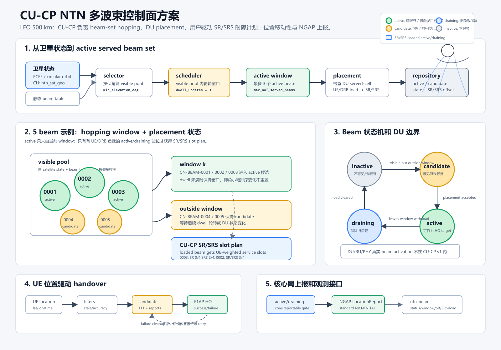

# CU-CP NTN 多波束方案可视化

> 本文和配图记录早期 satellite state→beam placement→handover→NGAP 主链，尚未完整呈现后续 64 个地固 NR 小区、星载再生 CU-CP、analog/digital 双层波束、RNTI lease、SR/SRS applied feedback、SIB19 和 UE capability gate。图中的旧 beam-to-NCI 关系只用于追溯当前原型，不代表目标架构。当前完整总览请阅读 [NTN CU-CP 中文主方案](ntn_cucp_solution_overview.md)。

下面这张图是当前 CU-CP v1 多波束方案的图片版。它把 satellite state、visible pool、hopping window、DU placement、UE 位置驱动 handover、NGAP 位置上报和责任边界放在同一张图里，便于整体检查。

图片文件：

- [SVG 矢量图](assets/ntn_cucp_multibeam_overview.svg)
- [PNG 图片](assets/ntn_cucp_multibeam_overview.png)

## 读图顺序

1. 左上从 `satellite state` 和 `static beam table` 开始，先得到 visible pool。
2. `scheduler` 在 visible pool 内按 `max_nof_served_beams` 和 `served_beam_hopping_dwell_updates` 形成 active hopping window。
3. `placement` 用 DU served-cell 能力和 UE/DRB 水位判断哪些 window 内 beam 可以 active。
4. CU-CP SR/SRS slot plan 只给 active/draining 且已有 UE/DRB load 的服务波位分配真实调度意图；按 UE 数给连续服务 slot 块，SR 放在块起点，SRS 放在块终点，空 active beam 不占 SR/SRS 周期资源。
5. repository 暴露 `active / candidate / draining / inactive` 快照，并带出 `slot_index/nof_slots/slot_period` 以及 `sr_slot_offset/period`、`srs_slot_offset/period`。
6. UE 位置移动性只消费 active subset；HO 成功或失败都会清理 candidate，失败后可由后续位置报告重新触发。
7. NGAP LocationReport 只在 serving NCI 属于 active 或 draining 时发送，且只使用标准 NR/NRNTNTAIInformation。

## 当前实现边界

这张图里的多波束是 CU-CP 控制面的 beam-set hopping。它已经覆盖 CU-CP v1 的移动性闭环，但不包含 DU/RU/PHY 的真实 slot 级 beamforming、precoder、beam activation、HARQ/Koffset/TA 和 Doppler 处理；这些仍放在 Phase 6。

本阶段新增的 SR/SRS slot plan 是 CU-CP 侧的时序调度意图：当某个波位上有 UE 接入或仍有承载需要维持时，CU-CP 为该波位生成周期性的 SR/SRS slot offset。它不直接替代 DU/MAC scheduler 的具体 PUCCH/SRS 资源分配，也不下发 PHY precoder；后续对接 DU/RU 后，可以把这个 plan 映射到 DU 的 SR/SRS resource manager、beam activation 和 beamforming 指令。

## 最新落点：DU SR/SRS 资源请求

当前代码已经补上第一段可执行落点：DU `cell_group_config` 新增 `ntn_ul_slot_request`，可携带 CU-CP 计算出的 SR/SRS offset 与 period。`du_ran_resource_manager_impl::create_ue_resource_configurator()` 会在初始 UE 资源分配前写入该请求，随后 `du_pucch_resource_manager` 和 `du_srs_resource_manager` 会优先采用这些参数来生成真实 UE 专属 PUCCH SR 与 SRS RRC 配置。

如果请求的 offset 当前不可用，或 CU-CP 给出的 period 与 DU 当前 PUCCH SR/SRS 周期配置不一致，DU 现在按 NTN 请求严格失败，而不是静默回退到其他 SR/SRS slot；这样 CU-CP 计算出的波位时隙不会被 DU 本地策略悄悄改写。非 NTN 路径仍沿用原有资源分配策略。当前接口使用 srsRAN 内部 `SRSNTN02` vendor container 承载，`flags=0` 表示清除旧 NTN slot request，同时保留旧 `SRSNTN01` offset-only 解码兼容；后续若要跨厂家互通，需要升级为明确协商的 private IE 或标准化扩展。

## 最新落点：F1AP 承载、DU 创建与在线重配置贯通

当前多波束 SR/SRS slot plan 已经从 CU-CP placement 进入 UE Context Setup 和 UE Context Modification 路径：当某个 active/draining 波位已经因为 UE 负载获得 SR/SRS offset 与 period 后，CU-CP 会在 Initial Context Setup、在线 UE 的后续 placement 更新、以及 PDU Session setup/modify/release 后的 bearer-load refresh 中生成 `f1ap_ntn_ul_slot_resource_request`。F1AP-CU 使用内部 `SRSNTN02` vendor 容器复用空的 `res_coordination_transfer_container`，F1AP-DU 解码后传入 DU UE creation 或 UE context update，最终落到 PUCCH SR 与 SRS resource manager。

因此图中的“CU-CP SR/SRS slot plan”现在不再只是可视化状态：它已经能影响新建 UE 和已 attach UE 的真实 SR/SRS RRC 资源分配。在线 UE 场景中，CU-CP 先发 UE Context Modification 给 DU，DU 重新分配 PUCCH/SRS 并返回 CellGroupConfig，CU-CP 再触发 RRC Reconfiguration 给 UE。CU-CP 还会按 UE 缓存最近一次 slot request，星历刷新但 SR/SRS offset/period 未变化时不重复下发；PDU Session 建立成功会主动刷新当前 visible beam placement 并触发 slot update，最后一个 DRB 释放后会主动发送空 `SRSNTN02` clear request 撤销旧 NTN 时隙意图。仍需注意的是，这个承载是 srsRAN 内部方案，不等价于标准化跨厂商 F1AP 扩展。
