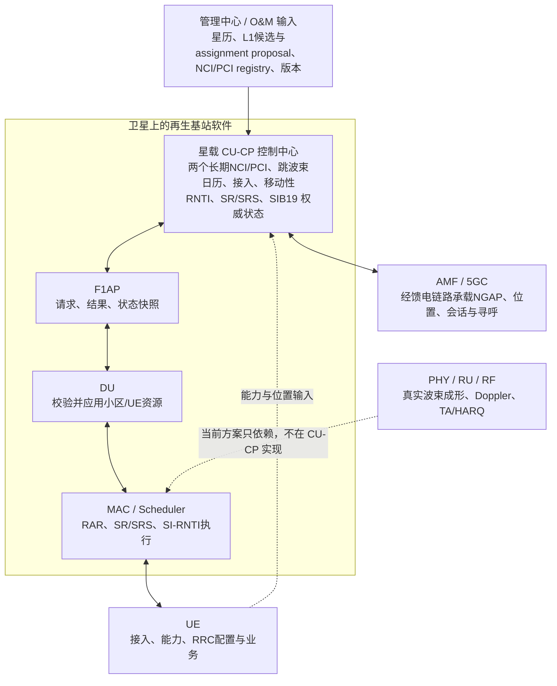
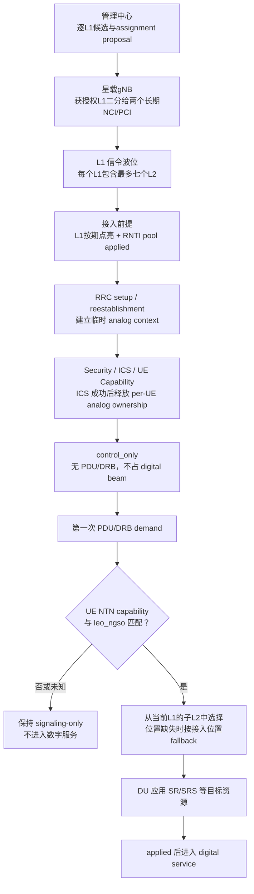
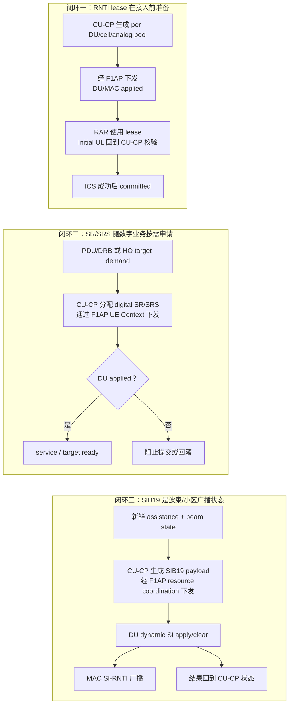

# NTN CU-CP 中文主方案

> 这是一份“先看懂、再深入”的总纲。目标系统是**星载再生基站**：CU-CP 部署在卫星上，控制星上小区和跳波束资源。最终工程方案采用 46 个轨道面、每面 65 颗，共 2,990 颗卫星，服务南纬 `57°` 至北纬 `57°` 的全球陆地。Web 离线结果是方案依据，不等于 CU-CP 或真实无线设备已经支持该目标。

## 1. 一句话看懂方案

这套方案把 CU-CP 作为星载基站的“控制中心”：每颗卫星运行两个长期星载 NR 小区，管理中心周期下发星历和经审核的 L1 assignment proposal，星载 CU-CP 把本星获授权的 L1 二分给两个 NCI/PCI，再用跳波束日历周期照射 L1、按业务需求照射 L2；只有 ready/applied 与 activation gate 完成后 proposal 才成为 actual serving。CU-CP 决定接入、RNTI、SR/SRS、SIB19、移动性和核心网上报策略，F1AP 负责传递，DU/MAC 负责实际应用并反馈结果。

方案的重点不是在 CU-CP 里模拟卫星无线信道，而是先建立一条可以观察、可以测试、失败后可以恢复的控制面闭环。

可以把它理解成一座移动的星载基站：

- 地面只固定全球 L1/L2 波位，像统一编号的服务位置；不预制地面 NR 小区，也不把 NCI/PCI 固定在地面。
- 每颗卫星有两个长期星载 NCI/PCI；它们随卫星移动，当前覆盖哪些 L1 由 ownership 和星上二分决定。
- L1 信令波位像周期点亮的“接入大厅”，即使没有 UE，也必须按日历发送 SSB。
- L2 数字波位像按需开放的“服务柜台”，只有 UE 真正需要 PDU/DRB 时才占用。
- CU-CP 是调度和审批中心，DU/MAC 是执行现场。
- F1AP 是中心与现场之间的传递通道。
- AMF 是核心网一侧，接收位置、会话和寻呼相关信息。

## 2. 最终方案与历史实现必须分开

### 2.1 下一阶段目标规划

目标架构面向南纬 `57°` 至北纬 `57°` 的全球陆地星载再生基站，最终采用 46×65、共 2,990 颗卫星。全球 Web 目录已经实现并有 focused 测试覆盖；CUCP-035/036 已实现默认关闭的版本化双小区计划、完整 L1 inventory、接入日历 dry-run、原子激活和 SSB/PRACH 软件 gate。7 天连续验收、可信 Initial UL position sideband，以及 PHY/RU/RF 真实跳波束仍为 `规划中`。

| 项目 | 目标规划值 | 如何理解 |
|---|---:|---|
| 服务 mask | `57°S～57°N` 全球陆地 | 海洋和更高纬度不纳入本阶段连续服务验收 |
| 最终星座方案 | `Walker Delta 60°:2990/46/33` | 46 个轨道面、每面 65 颗、500 km；3,528 颗模型仅为历史展示对照 |
| 新选 / 退出仰角 | `45° / 42°` | 形成 3° 滞回；500 km 下地面半径约 `448 / 494 km` |
| 地固 L1 / L2 | `36,411 / 249,375` | Web 已生成 `G######` / `G######-n`；正式运营 GIS 尚未冻结 |
| 星载 NR 小区 | 每星 `2` 个 | NCI/PCI 随星载小区，不地固、不跨星迁移 |
| NCI / NCGI | opaque 36-bit NCI 在 PLMN 内唯一 | NCGI = PLMN identity + NCI；Web 不验证 NCI 内部 gNB ID 分解 |
| PCI | 星载小区属性，可复用 | 对同时可见、同频的星载小区建立冲突图后着色，不要求全球唯一 |
| 单星资源池 | `32 analog / 128 digital` | 两个星载小区各固定 `16/64`，暂不跨小区借用 |
| 派生日历容量 | 每小区 `128` L1、每星 `256` L1 | 80 ms 最差相位有 168 次机会，配置取 128；属于 Web 日历硬保证，非 PHY/RU 证明 |
| L1 ownership | 每个 epoch 最多一个 primary owner | target 可准备，但不成为第二个 primary |
| L1 SSB / PRACH 重访 | `80 / 640 ms` | 均为规划参数，不是协议常量 |

规划 NCI 是管理中心 registry 分配的 opaque 36-bit ID，不从 `satellite_id`、波位 ID 或坐标推导。2,990 颗最终方案需要 `2,990 × 2 = 5,980` 个星载小区 NCI；现有 3,528 颗展示 registry 的 7,056 个 NCI 不能直接复用。NCI 在 PLMN 内唯一，NCGI 由 PLMN identity 与 NCI 组合后全球唯一。无需额外引入 `onboard_cell_index` 或 `SatelliteCellBinding`。PCI 绑定长期星载小区，由“同频且同时可见”冲突图统一复用规划；它不随每次跳波束访问改变。当前还没有全球连续时间 PCI 冲突报告。

日历使用 10 ms access slot，每个 DL 端口在 slot 内有 4 次顺序 `2.5 ms` 子访问；三相位模拟 DL/UL 为 `11/5、11/5、10/6`。任意 80 ms 窗口的最差对齐仍有 42 个 DL port-occasion，即 168 次访问机会，配置容量取 `min(168,128)=128` L1/小区、256 L1/星。因此 128/256 是当前 Web 离散日历的最差相位硬保证，不是平均值或理论机会总数；真实 guard、功率、带宽、公共信令、PRACH 和 PHY/RU/RF 仍需工程复核。

全球目录已由 [`generate-global-land-catalog.mjs`](../web_replicas/ntn_beam_planner/scripts/generate-global-land-catalog.mjs) 使用本地 Natural Earth 4.1.0 / `world-atlas@2.0.2` 1:50m land 生成到 [`global-land-l1-v1.json`](../web_replicas/ntn_beam_planner/public/data/global-land-l1-v1.json)。目录含 36,411 L1、249,375 有效 L2、33,871 full 和 2,540 edge；244 个等 `sin(latitude)` 分带的目标单元面积为 `3,117.691454 km²`，最大偏差 `0.1115%`，cells SHA-256 为 `b39fe9c3ee9a9355b3546036b7f16e0fb858c953f8558cc4295122f2169fbe7a`。

生成方法是球面等面积 quasi-hex 中心格和陆地中心点包含，必须保留两个限制：`exactRegularSphericalHexagons=false`、`exactCoastlineClipping=false`。它不是严格正球面六边形，也不是正式运营 GIS 的精确海岸裁剪。

全球 coarse 证据必须分三层读取：

| 场景 | 已生成结果 | 能得出的结论 |
|---|---|---|
| `60°:3528/42/0`，`t=0` | 23 个 L1 无 45° 候选；峰值 visible load `206/256`；0 星溢出 | F=0 seed 明确失败，不可 selected |
| `60°:3528/42/1`，`t=0` | 0 空窗；最少候选 1；峰值 `207/256`；0 星溢出 | 只证明该单一 epoch 的 coarse 条件 |
| `60°:3528/42/1`，一天/120 s | `720/720` 离散 epoch 无空窗；最少候选 1；峰值 `209/256`；溢出 epoch 0 | `auditLevel=coarse`、`exact=false`，不证明采样间连续性 |
| `60°:2990/46/33`，一天/120 s | `720/720` 离散 epoch 无空窗并完成唯一分配；实际负责峰值 `87/星`、`44/小区` | 最终采用方案的设计依据；仍需 7 天连续覆盖和真实无线验收 |

[`global-constellation-audit.json`](../web_replicas/ntn_beam_planner/app/global-constellation-audit.json) 仍记录 `selectedScenario=null`、exact audit `status=not_run`，表示连续验收记录尚未完成，不再表示卫星数量没有结论。没有真实 7 天事件驱动精确报告时，不得写“连续覆盖已通过”，也不得声称 N-1、handover、ready/applied、PCI 或 PHY/RU/RF 已验证。

旧 `Walker Delta 53°:720/30/1`、大陆及海南 `2,620/18,208` 波位目录和一天 120 s 采样数字只作为历史中国样例保留。旧样例曾得到 `720/720` 离散快照、`1,261,561` 个旧 owner 变化/释放等结果；这些数字不能外推到全球 mask，也不是事件驱动 handover 报告。

### 2.2 Legacy beam-table 运行路径（仍保留）

当前代码仍保留一条确定、可重复的单星 LEO/NGSO legacy beam-table 控制面路径。下面的数字只用于说明这条历史兼容路径，不能当成上一节双小区载荷已经实现，也不能与其资源限制混用。

| 项目 | 当前基线 | 如何理解 |
|---|---|---|
| 部署 profile | `leo_ngso` | 当前按 LEO/NGSO UE 能力匹配 |
| 卫星数量 | 单星 | 多星目录与跨星选择延后 |
| 轨道输入 | `circular_orbit` | 用确定性圆轨道先验证控制面；接口保留 `manual` 和 `tle` |
| 高度 | `500000 m` | 500 km LEO 基线 |
| 轨道倾角 | `53 deg` | 当前示例配置值 |
| 最低服务仰角 | `50 deg` | 低于该阈值不进入当前服务候选 |
| 数字服务波束半径 | `15 km` | 服务粒度，不代表 RU 真实波束成形已经实现 |
| 数字服务波束 | `843` | 当前原型的服务和索引粒度；目标架构需要重构其 beam-to-NCI 关系 |
| 模拟接入波束 | `137` | 对数字波束做接入分组；包含 `109` 个完整 7 波束组和 `28` 个边缘不完整组 |
| 候选清单上限 | `max_nof_served_beams: 0` | `0` 表示不以 loaded 上限裁剪候选清单 |
| 同时 active 的模拟接入波束 | `16` | 当前示例策略值，不是协议常量 |
| 同时 loaded 的数字服务波束 | `256` | 当前示例容量值；`0` 才表示无 CU-CP 上限 |
| 波束窗口轮转 | enabled，dwell `3` 次更新 | 控制面窗口策略，不是 PHY slot 级 beam hopping |
| 卫星状态更新 | `1000 ms` | 当前示例配置值 |

这些数字来自 [当前 LEO 500 km 示例配置](../configs/leo_500km_cucp_ntn.yml) 和 [波束表](../configs/leo_500km_beam_table.json)。`843/137/16/256` 是当前运行原型；旧中国 `2,620/18,208` 与 `16/128` 是历史 Web 样例；全球目标是待生成的 `G` 目录与每星 `32/128`。三者都不是协议常量，也不能互相替代或被描述成同一套已实现能力。

## 3. 谁负责什么

| 层次 | 当前责任 | 不应被误解为 |
|---|---|---|
| 星载 CU-CP | 读取版本化波位表、把 L1 二分给两个星载小区、生成日历、控制接入与服务资源、移动性、NGAP、寻呼、审计恢复 | 不做真实射频波束成形，不执行 HARQ、TA 或 Doppler 补偿 |
| F1AP | 承载 CU-CP 与 DU 之间的资源请求、结果和状态快照 | 当前 private/vendor 容器不等于标准化跨厂家接口 |
| DU | 校验目标 cell/UE，应用或拒绝 CU-CP 请求并返回结果 | 不替 CU-CP 决定 NTN 服务策略 |
| MAC/Scheduler | 消耗 RNTI lease，执行 RAR、SR/SRS 和动态 SI 配置 | 不在本方案中成为新的 NTN 策略权威 |
| AMF/5GC | NGAP 控制、位置上报、PDU Session、Paging | 不接收私有经纬度扩展 |
| PHY/RU/RF | 未来执行真实天线、时序、波形和射频动作 | 当前控制面状态不能证明这些动作已经发生 |

最重要的边界是：**CU-CP 部署在卫星上并不改变协议分层；CU-CP 可以决定并请求，但只有收到 DU 的 applied feedback，才能说执行层已经应用。**

## 4. 星载小区与两级地固波位

目标方案不是 `NCI ↔ 波位`，也不是 `NCI ↔ 地面分区`。正确层次是：地面目录只有 L1/L2 位置；每颗卫星有两个长期星载 NR 小区及各自的 NCI/PCI；管理中心决定每个 L1 的主用卫星，星载 gNB 再把本星获授权的 L1 二分给两个小区。运行时 L1/L2 从当前映射获得 NCI/PCI，映射可以随时间变化。

NCI 是 opaque 36-bit planning ID，在 PLMN 内唯一；NCGI 由 PLMN identity 与 NCI 组合后全球唯一。当前模型不验证 NCI 内部 gNB ID 分解。PCI 只有 1,008 个值，不要求全球唯一；应把同时可见且同频的两个星载小区连成冲突边，再在冲突图上规划可复用 PCI。NCI/PCI 都随长期星载小区，不随 L1 跨星迁移，也不从 `satellite_id` 或坐标推导。

如果 RRC 接入时就给每个 UE 长期占住一个 15 km 数字波位，候选位置很多时会浪费 RNTI、SR/SRS 和服务容量。因此方案仍把“进门”和“真正办业务”分开。

### 4.1 L1 analog signaling position：周期信令位置

L1 是地固信令波位和模拟信令波束照射目标，通常包含一个中心 L2 和最多六个相邻 L2。它不是 NR 小区，不保存永久 NCI/PCI，但保留全球 `G######` ID、几何、邻接、SSB/PRACH deadline 和接入观测。

当前获授权的 L1 从星上二分结果得到 NCI/PCI 和公共小区配置。即使没有终端接入，它仍必须在 `80 ms` 目标重访期限内得到 SSB 照射。

### 4.2 L2 digital service position：按需业务位置

L2 是规划粒度的地固数字业务位置，不是独立 NR 小区。它使用 `G######-n` ID，通过父 L1 获得当前星载小区映射，并负责几何、复用关系、PDU/DRB 归属、loaded calendar、SR/SRS、QoS 和资源审计。

## 5. UE 从接入到释放的完整过程

1. **网络先准备接入条件。** CU-CP 根据卫星和波束状态选出 active analog access beams，并提前向对应 DU/cell 分发 RNTI lease pool。没有 applied pool 的区域不能接收新的 NTN UE。
2. **UE 完成 RRC 接入。** DU/MAC 从已应用的 pool 取一个 RNTI 放进 RAR；CU-CP 收到 Initial UL 后检查这个 RNTI 是否属于正确的 DU、cell 和 analog beam。
3. **完成控制面建立。** Security、Initial Context Setup 和 UE Capability Transfer 可以继续。能力未知时允许 signaling-only，不代表允许数字业务。
4. **ICS 成功后释放 analog ownership。** UE 的 CU-CP context 仍存在；如果没有 PDU/DRB，它进入 `control_only`，不占 digital beam、loaded calendar 或 SR/SRS assignment。
5. **第一次业务请求触发数字服务绑定。** CU-CP 先检查 NTN capability、profile、波束新鲜度、容量、冲突域和 QoS，再选择 digital service beam。
6. **DU 应用资源后才算服务 ready。** CU-CP 通过 F1AP UE Context 路径发送 SR/SRS assignment；DU 返回 applied/rejected。rejected 时不能把 UE 标成 service-bound。
7. **移动时先准备目标，再发 HO。** connected handover 必须先为目标准备 C-RNTI 和目标 SR/SRS，目标 applied 后才允许源侧发送 RRC handover reconfiguration。失败时回滚目标资源，保留源侧服务。
8. **最后一个 DRB 释放后清理数字资源。** UE 可以继续保留控制面 context；release/paging hint 只在能力匹配、TAC 有效和波束状态允许时提供。

上述 UE 资源闭环来自当前原型并继续作为目标架构的控制面基础，但目标跳波束日历增加了一条独立规则：网络级 L1 SSB 广播不因 per-UE analog ownership 在 ICS 后释放而停止。即使当前星载小区没有 UE，其 active L1 仍要满足 `80 ms` SSB 重访期限；只有 L2 数字业务资源随 PDU/DRB demand 开关。

## 6. 三个资源闭环

### 6.1 RNTI lease：为什么必须提前分发

随机接入时，DU/MAC 必须在 RAR 阶段就给出临时号码；CU-CP 此时还没看到 Initial UL，因此不能等 UE 上来以后再生成。正确顺序只能是：CU-CP 预分发，DU/MAC 消耗，CU-CP 事后按权威 pool 校验并提交。

### 6.2 SR/SRS：为什么必须等反馈

CU-CP 计算出来的 offset/period 只是 assignment。DU 的 PUCCH/SRS 资源可能冲突或配置不匹配，所以必须返回 applied/rejected。只有 applied 的 digital service 才能进入 ready 状态。

### 6.3 SIB19：为什么不看单个 UE capability

SIB19 描述网络侧的卫星 assistance 和小区广播状态，应该随着 beam/cell 状态更新。某个 UE 是否支持 Rel-17 NTN，只决定这个 UE 能否进入 NTN 数字服务，不决定网络是否广播 SIB19。

当前 SIB19 运行态证据证明了 CU-CP 生成、F1AP 协作、DU 动态 SI 应用和 MAC SI-RNTI 抓包；现有外部 srsUE 是 RRC Release 15，**不能据此宣称 UE 已完成 Rel-17 SIB19 解码**。

## 7. UE capability gate

当前 `leo_ngso` profile 使用 Rel-17 `nonTerrestrialNetwork-r17` 和 `ntn-ScenarioSupport-r17` 做 UE 级别的门控：

| UE 能力状态 | signaling-only | 数字服务、connected HO、release/paging hint |
|---|---:|---:|
| capability 未知 | 允许 | 不允许 |
| 没有 `nonTerrestrialNetwork-r17` | 允许保留已有控制面 | 不允许 |
| NGSO | 允许 | 允许 |
| both | 允许 | 允许 |
| 支持 NTN 但 scenario 字段缺失，即 `implicit_both` | 允许 | 允许 |
| GSO-only | 允许 | 在 `leo_ngso` 中 profile-blocked |
| malformed capability | 保守处理 | 不允许 |

`ntn-Parameters-r17` 当前只用于观测，不作为 v1 的额外准入门限。

## 8. 波束状态、移动性和核心网上报

### 8.1 不要把 candidate 和 loaded 混为一谈

| 状态/集合 | 含义 | 是否消耗数字服务资源 |
|---|---|---:|
| `candidate_inventory` | 当前配置、卫星状态、服务窗口和 DU support 下可考虑的完整数字波束清单 | 否 |
| `mobility_eligible_beams` | candidate 中可作为位置/测量移动目标的子集 | 否 |
| `active_loaded` | 已有 UE、DRB、重建或 HO demand 的数字波束 | 是 |
| `draining` | 不再接收新 UE，但暂时保留旧 UE/DRB 的波束 | 可能继续消耗 |
| `inactive` | 不可见、过期、不受支持或不可用 | 否 |

关键不变量是：`candidate_inventory` 永远不能被 loaded beam 容量上限裁剪；只有真实业务需求才能进入 loaded service calendar。

### 8.2 connected mobility

- CU-CP 接收已经解码的 UE location，并检查时间、精度、连续报告数、TTT 和边界 hysteresis。
- 目标必须属于可用 analog parent 下的 eligible digital beam。
- 目标服务先 preload，再准备 C-RNTI 和 SR/SRS。
- 目标未 ready 时不发送 RRC HO command。
- HO 失败清理目标 reservation，但不破坏源侧服务；后续新位置报告可以重试。
- NTN 开启时，普通 terrestrial RSRP measurement 不能绕过 NTN gate 直接触发错误 HO。

### 8.3 NGAP、Paging 和 QoS

- NGAP 使用标准 `LocationReport`、`UserLocationInformationNR` 和 `NRNTNTAIInformation`，不添加私有经纬度扩展。
- serving NCI 只有在当前 active/draining 且 core-reportable 时才上报。
- legacy NTN profile 继续使用 beam-derived TAC/TAI；onboard execution 使用当前 DU 小区的 PLMN、稳定 NCI 和 TAC，不从一级波位编号或坐标推导 TAC。
- onboard execution 中，同一个稳定 NCI 可以负责多个一级波位，这些波位共享该小区的 NCGI 和 TAI。完整 `PLMN+TAC` 必须在 NGAP supported TA 中唯一匹配。
- UE 释放时保存的是当前稳定小区及其计划版本，不猜测具体一级波位。Paging 只在这份记录仍与当前 schedule、calendar、有效期、NCGI 和 TAI 完全一致时缩小到对应 NCI；记录过期或不匹配时继续普通 TAI Paging。
- 当前路由绑定 DU served cell 的 primary NCGI。UE 使用同一小区的 secondary PLMN 时，不生成 onboard release location 或单小区 Paging 推荐。
- QoS policy 可使用 ARP、5QI、GBR、slice 和 emergency priority 排序新 demand，但不把 CU-CP policy 描述成 MAC 调度或既有 bearer 的物理抢占。
- soft switch-over 减少新准入并准备迁移；hard switch-over 停止新准入并触发 draining、HO 或 release。

### 8.4 逐 L1 ownership 与位置接管

规划器为每个 L1 保留所有达到 `45°` 的可见卫星，当前 owner 可滞回保持到 `42°`。这份完整 `visible inventory` 不受每星 256 或每小区 128 的服务容量裁剪；容量只参与 assignment proposal。管理中心审核后下发带版本和 activation epoch 的波位表，星载 gNB 再将本星获授权 L1 二分给两个长期 NCI/PCI；空间紧凑/连通只是 best-effort 目标。

L1 跨星时不迁移 NCI：源、目标分别使用自己的星载 NCI/PCI。只有二者 NCI/PCI 不同，目标才可以为发现/测量做重叠广播；此时 primary 仍在源侧。目标 ready、DU `applied` 且到达对齐 640 ms 的 activation epoch 后，proposal 才能提交为 serving。连接态 UE 通过 HO/CHO，空闲态 UE 通过重选；同星在两个 NCI 之间重新分组也属于小区关系变化。当前 CU-CP 已实现单星计划的原子切换和软件 gate；全球跨星 ownership producer、UE 跨星流程与 RF 执行仍未闭环。

运行映射进一步区分“换了一级波位”和“换了 NR 小区”：两个不同 `position_id` 仍属于同一个 NCI 时记为 `same_cell`，不触发 handover；所属 NCI 改变时记为 `cell_change`。当前生产 Initial UL 和位置报告尚未提供可信 `position_id`，因此这项能力先用于查询和审计，没有接入真实 handover。

### 8.5 计划更新、重启和 DU 重连

管理中心计划不是“读到文件就立即生效”。CU-CP 先记录最新解析计划的版本、hash、启用时间和完整 L1 清单，用于只读观测，再校验规划上下文、两个长期小区身份、版本、有效期和 hash，随后做双小区划分和 640 ms 日历审计。新计划全部通过后才成为 pending；即使 DU 提前报告软件 `applied`，仍要等到 `activation_epoch` 才能替换 active。

执行模式使用私有状态文件保存 accepted version high-water、active/pending、双小区划分、软件下发状态和待确认清理任务。状态 schema v2 还把“最新成功解析输入的摘要”作为独立只读观测保存，内容是 catalog/schedule version、content hash、activation epoch 和完整 candidate inventory，不是原始 JSON 的逐字段副本。因此收到 257 条 L1 时，系统会完整显示 257 条并报告 `schedule_overflow`，但它不会提高 accepted high-water、不会激活，也不会替换旧有效计划；旧计划清理和再次重启后，这 257 条仍不会被裁剪或回退成旧 inventory。

DU 断开会立即使旧连接上的 `applied` 证据失效。CU-CP 保留计划和旧计划恢复副本，重连后只接受当前连接、当前请求、同一 version/hash 的完整回复；旧连接迟到的反馈不会恢复状态。未来计划若在启用前再次断开，历史 active fallback 仍保留。DU 确认 clear 后，CU-CP 先 durable 保存“不再包含该任务”的新状态，成功后才从内存删除，避免断电或重启造成清理任务丢失。

这套机制解决的是 CU/DU 软件状态恢复。状态文件还不是可信单调锚点，本地连接代次也不是发送方认证；它们都不能证明 RF beam steering、真实 PRACH 接收或全球连续覆盖。

## 9. 资源一致性和可观测性

CU-CP 是 NTN 资源权威，但分布式系统可能因为超时、重连或部分失败出现“CU-CP 认为已下发，DU 实际没有”的情况。因此当前方案包含 consistency auditor 和 repair executor：

1. 通过 F1AP 查询 DU 的 RNTI、SR/SRS 和相关 NTN 状态快照。
2. 与 CU-CP 的 desired/committed 状态比较。
3. 生成 resend、reapply、clear、rollback 或 conflict-block 动作。
4. 对重复冲突保守阻断，不仅因为一次 mismatch 就强制释放已提交 UE。

主要运行态命令包括：

- `ntn_state`：整体卫星、assistance、资源和 SIB19 状态，并显示运行映射阶段、一级波位总数、两个小区的 PLMN/TAC/TAI、Paging 状态和有效 idle context 数量。
- `ntn_assistance`：当前 NTN assistance snapshot。
- `ntn_beams`：analog/digital beam、candidate/loaded/draining 和原因。
- `ntn_ues`：UE access/service、capability、位置和 HO 状态。
- `ntn_diagnose`：资源差异和建议动作。
- `ntn_repair`：执行受控修复。
- `ntn_sat` / `ntn_sat_geo`：联调时注入卫星状态。

## 10. 当前完成度与证据

状态按证据强度递增：

- `规划中`：只有设计方向，还没有当前工作区实现。
- `已实现`：当前工作区能找到实现或可执行入口，但本表没有引用通过的测试结果。
- `已有测试覆盖`：存在对应 focused 单元/集成测试；表示有测试资产，不等于本次文档修改重新跑过。
- `已有运行态证据`：已有日志、pcap 或运行摘要；只证明摘要明确写出的范围。

| 能力 | 当前状态 | 能证明什么 | 仍不能证明什么 |
|---|---|---|---|
| 卫星状态、完整 candidate inventory、loaded calendar | 已有测试覆盖 | selector、scheduler、placement 和状态分类有 focused tests | 长时间真实星历运行 |
| analog/digital 双层波束与接入/服务分离 | 已有测试覆盖 | 843/137 模型、ICS 后 analog release、`control_only` 和首次业务绑定有测试资产 | 真实天线模拟/数字波束硬件 |
| RNTI lease pool 与接入生命周期 | 已有测试覆盖 | CU-CP/F1AP/DU/MAC 的 pool、RAR、校验和状态转换有测试资产 | 商用 UE/多厂家互通 |
| digital SR/SRS assignment 与 applied feedback | 已有测试覆盖 | UE Context、DU resource manager 和 scheduler consistency 有测试资产 | PHY 实际 SRS 发射效果 |
| connected handover target reservation | 已有测试覆盖 | 目标资源先于 HO command、失败回滚有测试资产 | 真实移动 UE 的空口 HO 成功率 |
| SIB19 CU-CP→F1AP→DU/MAC | 已有运行态证据 | dynamic SI apply、F1AP pcap、MAC SI-RNTI pcap 均有记录 | 当前 srsUE 的 Rel-17 SIB19 解码 |
| UE capability / `leo_ngso` profile gate | 已有测试覆盖 | task index 记录 focused CTest `12/12` 通过 | 商用 NGSO UE 能力组合覆盖 |
| NGAP location、TAC/TAI、Paging、QoS、switch-over | 已有测试覆盖 | 相应 CU-CP/NGAP/paging/policy tests 存在 | 真实 AMF 的完整 NTN 互通矩阵 |
| 资源 audit / repair 与 CLI | 已有测试覆盖 | query、compare、repair action 和命令测试存在 | 长时间掉线重连下的恢复稳定性 |
| split attach、ICS、Capability、PDU Session、ping 基线 | 已有运行态证据 | 当前 srsUE/Open5GS/split 栈完成过基础业务链路 | 该基线本身不等于全部 NTN 功能通过 |
| CUCP-075 系统测试编排 | 已实现 | live/sim 场景 registry 和统一入口已经存在 | 当前没有 `CUCP-075-*` suite summary，不能宣称整套已通过 |
| 历史 3,528 颗展示模型的星载 NCI/PCI registry | 已有测试覆盖 | Web 生成 7,056 个唯一 36-bit NCI；CU-CP 接收显式 opaque identity，禁止运行时派生 | 最终 2,990 颗方案所需的 5,980-NCI registry 尚未生成；局部 Walker proxy 也不是全球连续可见性/RF 冲突图 |
| 全球目录生成器、asset 与 loader | 已实现 | Web 已生成并加载 36,411 L1 / 249,375 L2 | 不等于 CU-CP 运行态或正式运营 GIS 冻结 |
| 全球目录确定性、land containment 与完整性 | 已有测试覆盖 | `catalog:check` 和 focused 目录测试 `6/6` 通过 | `exactRegularSphericalHexagons=false`、`exactCoastlineClipping=false` |
| 全球 coarse visible inventory CLI 与报告 | 已有测试覆盖 | 2,990 颗方案一天/120 s 为 720/720 离散 epoch，并完成唯一分配 | 支持工程方案决定，但固定步长采样不证明连续覆盖 |
| 全球 exact visible inventory 与 assignment | 规划中 | 目录和 coarse CLI 可作为输入 | 7 天事件驱动审计 `not_run`，`selectedScenario=null` |
| `128 × 2 = 256` 日历硬保证 | 已有测试覆盖 | 最差 80 ms 日历 168 次机会，配置取 128/小区 | 尚无真实 guard/功率/带宽和 PHY/RU 证据 |
| 版本化波位表、双小区划分与软件 activation gate | 已有测试覆盖 | CU-CP 完整 inventory、hash/version、80/640 ms 日历、原子切换与 DU/MAC software feedback | 尚无全球 producer、可信 Initial UL position 或 RF 证据 |
| 计划重启、DU 重连与持久化清理 | 已有测试覆盖 | 历史 applied 隐藏、当前连接精确核对、旧回复隔离、future epoch fallback、257 条观测和 durable cleanup 均有 focused tests | 尚无可信单调存储、发送方认证、live SCTP endurance 或设备回执 |
| Initial UL active-plan audit | 已有测试覆盖 | 私有纯审计器可核对完整 sideband 测试输入 | 标准 F1AP Initial UL 不携带 position/version/hash/RO/port；production gate 未接入 |
| 全球位置接管与 PCI 冲突图 | 规划中 | 已明确唯一 primary、ready/applied 和 activation gate | 尚无全球连续时间/RF 证据 |
| 多星、SGP4、真实 RRC 位置、Rel-17 UE、PHY/RU 执行 | 规划中 | 已明确后续方向和边界 | 尚无完整实现或系统证据 |

现有证据入口：

- [CUCP-034 focused 测试记录](ntn_cucp_task_change_index.md#current-useful-validation-notes)：记录 capability 相关 focused CTest `12/12`。
- [split UE 基础流程摘要](../run_artifacts/srsran_runtime_capture/cucp_ue_flow_summary_latest.md)：记录 RRC、ICS、Capability、PDU Session 和 UE IP。
- [CUCP-058 SIB19 运行态摘要](../run_artifacts/srsran_runtime_capture/split/log_exports/CUCP-058-20260626-004204/sib19_ue_visibility_summary.md)：明确 PASS 范围和 UE decode 未声明范围。
- [NTN system suite 使用说明](../run_artifacts/srsran_runtime_capture/split/ntn_system_suite/README.md)：说明 live、sim、pcap 和 cleanup 场景；当前未发现 CUCP-075 汇总报告。
- [全球目录生成器](../web_replicas/ntn_beam_planner/scripts/generate-global-land-catalog.mjs) 与 [focused 目录测试](../web_replicas/ntn_beam_planner/tests/beam-catalog.test.mjs)：`catalog:check` 和目录测试 `6/6` 通过。
- [全球 coarse audit CLI](../web_replicas/ntn_beam_planner/scripts/audit-global-constellation.mjs) 与 [focused CLI tests](../web_replicas/ntn_beam_planner/tests/global-constellation-audit-cli.test.mjs)：测试 `2/2`；报告为 [F=0 snapshot](../web_replicas/ntn_beam_planner/app/global-constellation-snapshot.json)、[F=1 snapshot](../web_replicas/ntn_beam_planner/app/global-constellation-f1-snapshot.json) 和 [F=1 one-day coarse](../web_replicas/ntn_beam_planner/app/global-constellation-f1-day-coarse.json)。

## 11. 必须长期保持的规则

1. 完整 `visible inventory` / `candidate_inventory` 不受 active L1、服务容量或 loaded beam 上限裁剪。
2. ICS 成功后释放 per-UE analog ownership；无 PDU/DRB 的 UE 是 `control_only`。
3. CU-CP assignment 不等于 DU applied；数字服务只在反馈成功后 ready。
4. SIB19 是 beam/cell 网络状态，不依赖单个 UE capability。
5. NTN 扩展不得改变 terrestrial 默认分配、接入和移动性路径。
6. 地面 L1/L2 不拥有永久 NCI/PCI；NCI/PCI 属于星载小区，不随 L1 跨星迁移。
7. 每颗卫星运行两个长期星载小区，每个小区固定 `16 analog / 64 digital`，整星 `32/128`，暂不互借资源。
8. 离线 assignment 只是 proposal；ready/applied 与对齐 640 ms 的 activation epoch 满足前，不得称为实际 serving 切换。
9. 每个 L1 在一个 epoch 最多一个 primary owner；只有 target 与 source 的 NCI/PCI 不同，才允许发现/测量重叠广播。
10. `128/256` 是当前 20 ms occasion、4-occasion 滑窗、三相位端口数和每端口 4×2.5 ms 子访问模型的最差相位硬保证；它不是协议或硬件常量，真实 PHY/RU/RF 仍待验证。
11. 即使没有 UE，所有 active L1 仍必须按 `80 ms` 目标重访期限周期发送 SSB；每个有效 PRACH RO 都必须有对应接收波束。
12. DU 断开后，旧连接上的软件 `applied` 立即失效；只有当前连接的完整精确查询可以恢复。
13. 257 条输入必须完整保留并拒绝执行，不能因重启、清理或旧 active snapshot 被裁剪成 256 条或更少。
14. 一个稳定 NCI 可以同时负责多个一级波位；一级波位变化只有在 owner NCI 改变时才形成小区变化。
15. onboard TAI 必须来自唯一匹配的 DU served cell，不从 `G######`、坐标或波位序号推导。

## 12. 下一阶段路线

### 阶段 A：完成离线规划闭环

- 以已生成的 `G######` / `G######-n` Web 目录为仿真输入，另行评审正式运营 GIS、精确海岸裁剪和版本冻结；旧中国 2,620 L1 只留作回归样例。
- 以最终采用的 `60°:2990/46/33` 为对象冻结公共 epoch 和绝对相位，完成 7 天连续验收；`selectedScenario` 在精确审计完成前保持为空。
- 建立每星两个长期 opaque NCI 的 registry，并按同时可见、同频冲突图规划可复用 PCI。
- 用事件驱动传播连续捕获 `45°/42°` 进入、退出、容量饱和和接管事件，至少运行 7 天，并加入 N-1、gateway、切换惩罚、ownership 冻结、滞回与 CHO。
- 对 `128/256` 日历保证做 guard、功率、带宽、SIB/Paging/RAR 和上行 PRACH 工程复核，再把 2.5 ms retarget 交给 PHY/RU 验证。
- 生成每星、每 NCI 的端口 proposal 日历，并检查 SSB、PRACH、ready/applied 与 640 ms activation gate。

### 阶段 B：完成 Web 联动与可读验收

- 轨道、卫星、NCI/PCI、L1/L2、ownership 和端口日历共享时间与选择状态。
- 显示搜索 seed、完整 visible inventory、当前获授权 L1、两套 `16/64` 资源泳道和位置接管 proposal 时间线。
- 明确把 Web 离线模型、CU-CP/DU 软件 gate 与真实 RF 执行分开：各自只按测试证据标注，不得借 Web 动画或 software `applied` 宣称 PHY/RU 或真实载荷已实现。

### 阶段 C：真实设备执行前评审

- 评审 NGAP 位置、TAC、Paging、handover、RNTI、SR/SRS 和当前 beam-to-NCI 索引的重构影响。
- 冻结 NCI/PCI registry、可信 Initial UL sideband、跨星 UE 上下文、故障恢复、硬件 beam handle 与 device-applied telemetry 后，才能授权扩展 PHY/RU/RF 运行代码。
- 在独立、明确授权的任务中对接 PHY/RU beamforming、Doppler、Koffset、TA、HARQ 和 RF。

## 13. 术语速查

| 术语 | 简单解释 |
|---|---|
| `candidate_inventory` | 现在可能提供服务的完整数字波束清单 |
| L1 / analog signaling position | 周期承载 SSB、系统信息、Paging 和初始接入的地固信令波位 |
| L2 / digital service position | 隶属父 L1、按 PDU/DRB 需求加载的地固业务位置 |
| 星载 NR 小区 | 随卫星移动的逻辑小区，拥有长期 NCI/PCI，当前覆盖的 L1 集合可变 |
| L1 ownership | 某 epoch 负责主用服务该位置的唯一卫星 |
| `control_only` | UE 已完成控制面建立，但没有数字业务资源 |
| `active_loaded` | 已有 UE/DRB/HO demand，正在占用服务资源 |
| `draining` | 不再接收新 UE，但暂时维持旧业务等待迁移/释放 |
| RNTI lease | CU-CP 预先授权给 DU/MAC 使用的 UE 号码 |
| SR/SRS | UE 上行请求与探测相关资源；CU-CP 分配意图，DU 实际应用 |
| SIB19 | NR NTN assistance 的系统信息广播 |
| ICS | Initial Context Setup，UE 核心控制面上下文建立阶段 |
| DRB | Data Radio Bearer，实际用户面业务承载 |
| applied feedback | DU 明确返回“已经应用”，不是仅仅收到请求 |
| NCI / TAC / TAI | NR 小区和核心网位置标识 |

## 14. 深入阅读入口

- [NTN CU-CP Agent Memory](ntn_cucp_agent_memory.md)：精简、稳定的设计决策。
- [运行时术语合同](../ai_harness/context/ntn_cucp_runtime_contract.md)：candidate、loaded、draining 等精确定义。
- [接口边界合同](../ai_harness/context/ntn_cucp_interface_contracts.md)：RRC、F1AP、NGAP 和禁止层次。
- [能力矩阵](../ai_harness/context/ntn_cucp_spec_matrix.md)：各能力是否属于 CU-CP。
- [Task Change Index](ntn_cucp_task_change_index.md)：功能到代码和测试区域的索引。
- [全球陆地轨道搜索方案](ntn_orbit_constellation_plan.md)：2,990 颗最终方案、7 天事件驱动验收和逐 L1 ownership。
- [星载双小区与波位规划](ntn_beam_constellation_plan.md)：L1/L2 目录、NCI/PCI 和载荷容量边界。
- [跳波束与初始接入设计](ntn_beam_hopping_access_plan.md)：`32/128` 资源日历、SSB 和 PRACH 时序。
- [早期 LEO 500 km 分阶段计划](ntn_cucp_leo_500km_plan.md)：Phase 0～6 的演进记录。
- [初版多波束可视化](ntn_cucp_multibeam_visualization.md)：早期 satellite→beam→HO→NGAP 图示。

## 15. 本文档的声明边界

- 本文整理当前工作区事实，不代表这些改动已经提交、合入上游或完成产品认证。
- `已有测试覆盖` 表示存在对应测试资产或已有 focused 记录，不表示本次文档整理重新运行了 CTest。
- `已有运行态证据` 只按链接摘要中的 PASS 范围表述，不扩大到 UE decode、PHY、RU 或跨厂家互通。
- 本文同步当前类型、配置与软件运行边界；private contract 不等于公开协议字段或设备能力。
- 全球 `G` 目录和 coarse audit CLI 在 Web 中已实现并有 focused 测试覆盖，但仍不是正式运营 GIS 或连续覆盖证明。最终采用 46×65、2,990 颗；其一天/120 s 的 `720/720` 结果仅为离散设计依据。CU-CP 已实现每星两个稳定小区、`128/256` inventory/calendar 包络和 `80/640 ms` dry-run，DU/MAC 只实现软件 gate；2.5 ms 真实 retarget、全球逐 L1 producer/接管、可信 Initial UL position 和 PHY/RU/RF 仍未实现。精确审计为 `not_run`，`selectedScenario=null`，表示上线验收尚未完成。
