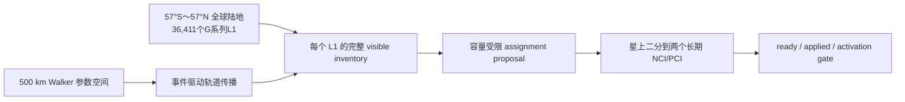
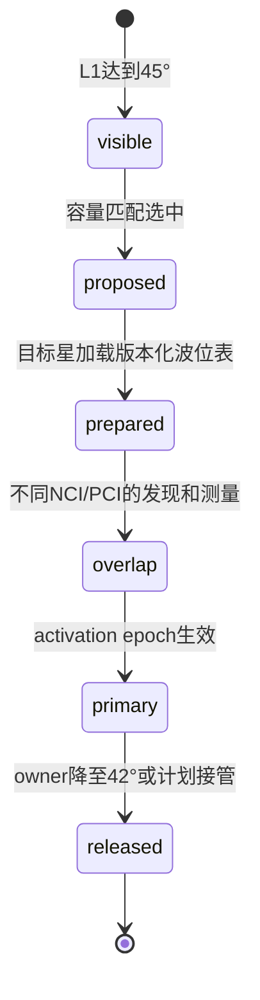

# ±57°全球陆地卫星轨道搜索与可视化方案

> 本文只定义全球目标的轨道搜索输入和验收方法；轨道传播、星座搜索与全球 ownership 仍属于管理中心/Web 离线规划，不复制进 CU-CP。现有 CU-CP 版本化双小区计划实现只消费本星已审核输入，不改变这里的轨道证据。`Walker Delta 60°:3528/42/0` 只是搜索 seed；在真实 7 天事件驱动精确审计完成前，`selectedScenario` 为空，不存在“已通过”的最终星座。

配套波位目录、小区身份和容量边界见 [全球陆地星载双小区与波位规划](./ntn_beam_constellation_plan.md)。

## 1. 一句话方案

在南纬 `57°` 至北纬 `57°` 的全球陆地区域使用已生成的地固 `G######` / `G######-n` 波位，以 500 km 单壳层 Walker 星座做参数搜索；轨道只决定每个时刻哪些卫星可见、哪个 assignment proposal 可行，NCI/PCI 始终属于每颗卫星上的两个长期 NR 小区。

## 2. 服务范围与系统边界

### 2.1 纳入规划

- 纬度闭区间 `[-57°, +57°]` 内、Natural Earth 1:50m 中心点判定为陆地的 Web 目录。
- 地固 L1/L2 的 ID、中心点、几何和邻接；跨星服务时这些属性不变。
- 每个 L1 的完整 `visible inventory`、容量受限 assignment proposal、星上双小区二分和接管准备。

### 2.2 暂不纳入连续服务验收

- 海洋、南北纬 57° 以外区域，以及正式运营 GIS 尚未冻结的海岸/国界 guard 区。
- 真实 gateway/feeder 可见性、链路预算、频率许可、星间链路、碰撞规避和发射批次。
- SGP4/J2 长期漂移、真实 TLE 误差、Doppler、TA、HARQ、功率和射频切换执行。

### 2.3 软件边界

管理中心负责星历、全球波位表、NCI registry、PCI 冲突图、assignment proposal、版本和 activation epoch；星载 CU-CP 读取并决策；F1AP 传递；DU/MAC 执行并反馈。Web 只展示搜索 seed 和离线状态，不代表执行层已经应用。

## 3. 搜索 seed

| 参数 | seed 值 | 说明 |
|---|---:|---|
| Walker 表达式 | `60°:3528/42/0` | 倾角 60°、总星数 3,528、42 面、`F=0` |
| 每面卫星 | `84` | `3,528 / 42` |
| 轨道高度 | `500 km` | 二体圆轨道传播 seed |
| 相邻面 RAAN | `360° / 42 ≈ 8.571°` | 精确值参与传播，不提前取整 |
| 面内相位 | `360° / 84 ≈ 4.286°` | 精确值参与传播，不提前取整 |
| 公共 epoch | 待冻结 | 所有对比场景必须使用同一 epoch |
| Walker 相位参数 | `F=0` | 仅 seed；后续必须扫描其他 `F` 和偏置 |
| 新选 / 退出仰角 | `45° / 42°` | 形成 3° ownership 滞回 |
| 服务 mask | `57°S～57°N` 全球陆地 | Web 目录 36,411 L1；正式运营 GIS 尚未冻结 |

500 km 下，`45°` 和 `42°` 的球面覆盖半径约为 `448 km` 和 `494 km`。这些数值只用于几何初筛，不等于链路可用半径。

### 3.1 卫星与星载小区身份

- 卫星规划短号使用当前 registry 的 `P01-S01`～`P42-S84`；CU-CP 只做 opaque exact-match，短号、轨道面、槽位和 epoch 是独立属性。
- 每颗卫星运行两个长期星载 NR 小区。NCI 由中心 registry 分配，在 PLMN 内唯一；NCGI 由 PLMN identity 与 NCI 组合后全球唯一。
- 若最终仍为 3,528 星，registry 需要 7,056 个 NCI；星座变化时数量随之变化。NCI 不从卫星短号、波位 ID 或坐标推导。
- PCI 不是全球唯一。把同时可见且同频的两个星载小区连接为冲突边，对动态时间并集图做可复用规划；PCI 不随每次跳波束访问改变。

## 4. 可见性、候选与容量必须分开

1. 新候选在 L1 处达到 `45°` 后进入 `visible inventory`。
2. 当前 owner 可滞回保持到 `42°`；低于 42° 才退出。
3. `visible inventory` 保存所有满足几何和外部可用条件的卫星，不受每星 256、每小区 128、active 或 loaded 上限裁剪。
4. 容量、端口、gateway 和迁移成本只影响 assignment proposal，不得反向删除可见候选。
5. proposal 不是 serving。只有目标 ready、DU `applied` 且到达对齐 640 ms 的 activation epoch 后，才能提交 actual owner。

## 5. 星载双小区与接管

每星两个长期小区各有 `16 analog / 64 digital`，整星为 `32/128`，暂不互借。当前 Web 日历以 4×2.5 ms sub-visit 得到最差 80 ms 窗口 168 次机会，并将配置容量限制为 128 L1/小区、256 L1/星；128/256 是该离散日历的硬保证，不是 PHY/RU/RF 或协议保证。星上把获授权 L1 二分给两个小区，负载均衡、空间紧凑、连通和 UE sticky 都是优化目标，不是现阶段已证明的硬保证。

跨星时不迁移 NCI。源、目标分别使用自己的星载 NCI/PCI；同一 L1 在一个 activation epoch 最多一个 primary。目标可以为发现和测量预热，但不能在 ready/applied 前被称为 serving。

## 6. Coarse 证据与 7 天事件驱动精确审计

当前已生成三份 coarse 报告：

| 场景/范围 | 无 45° 候选 | 最少候选 | 峰值 visible L1/星 | 超过 256 | 结论 |
|---|---:|---:|---:|---:|---|
| `F=0` seed，`t=0` | `23` | `0` | `206/256` | `0` 星 | seed 在该 epoch 明确失败，不可 selected |
| 同规模 `F=1`，`t=0` | `0` | `1` | `207/256` | `0` 星 | 单时刻无空窗，不证明连续性 |
| 同规模 `F=1`，1 天 / 120 s | `0`（`720/720` 离散 epoch） | `1` | `209/256` | `0` epoch | `auditLevel=coarse`、`exact=false`，采样间仍可能有空洞 |

报告见 [`global-constellation-snapshot.json`](../web_replicas/ntn_beam_planner/app/global-constellation-snapshot.json)、[`global-constellation-f1-snapshot.json`](../web_replicas/ntn_beam_planner/app/global-constellation-f1-snapshot.json) 和 [`global-constellation-f1-day-coarse.json`](../web_replicas/ntn_beam_planner/app/global-constellation-f1-day-coarse.json)。生成 CLI 为 [`audit-global-constellation.mjs`](../web_replicas/ntn_beam_planner/scripts/audit-global-constellation.mjs)，focused CLI tests [`2/2`](../web_replicas/ntn_beam_planner/tests/global-constellation-audit-cli.test.mjs) 通过。

这些报告是固定时刻/固定步长 coarse 证据。全球候选仍需至少连续 7 天的事件驱动精确审计：传播器精确定位仰角穿越、容量饱和、owner 释放、gateway 变化和接管窗口，再在事件之间验证不变量。

每个搜索场景至少输出：

| 指标 | 目的 |
|---|---|
| `zero_visible_interval` | 任一 service L1 是否出现无 45° 候选区间 |
| `minimum_visible_count` | 完整 visible inventory 的最小候选数 |
| `assignment_failure_interval` | 有候选但受局部容量约束无法分配的区间 |
| `assigned_l1_per_satellite` | 是否超过 seed 上界 256 |
| `assigned_l1_per_nci` | 是否超过 seed 上界 128 |
| `ownership_change_event` | 加入滞回、冻结和切换代价后的真实 proposal 变化 |
| `pci_conflict_interval` | 同频、同时可见星载小区是否复用同 PCI |
| `n_minus_one_failure` | 单星/单面失效后的局部服务缺口 |
| `ssb_deadline_miss` | 80 ms L1 SSB 重访是否失败 |
| `prach_deadline_miss` | 640 ms PRACH 重访是否失败 |

审计必须保存场景参数、代码/数据版本、事件时间、失败 L1、完整候选集合、卫星负载、NCI/PCI 和触发约束。没有这份报告，就不能把 seed 写成“已通过”。

### 6.1 场景选择规则

- 当前 `selectedScenario=null`，exact audit `status=not_run`。
- `60°:3528/42/0` 已被 `t=0` 的 23 个空窗明确排除，不能 selected。
- `60°:3528/42/1` 的一天 coarse 报告仍不能标为 `recommended`、`exact_pass` 或 `selected`。
- 至少比较面数、每面星数、倾角、`F`、RAAN/相位偏置、每星降额容量和 N-1。
- 搜索结果不保证随卫星总数单调改善；必须用同一 mask、epoch 和事件模型比较。
- 只有完整 7 天报告满足冻结的验收门限后，评审流程才能填写 `selectedScenario`。

## 7. Web 展示要求

- 3D 地球显示 42 面、3,528 星和 `57°S～57°N` 服务带，但显著标注“搜索 seed”。
- 2D 地图使用已生成的 `G######` / `G######-n` Web 目录；正式运营 GIS 冻结仍需单独评审。
- 轨道、时间、卫星、NCI/PCI、L1/L2、visible inventory 和端口日历共享选择状态。
- 选择 L1 时先显示完整 visible inventory，再显示容量匹配结果，不能只展示被选中的服务星。
- 展示 `F=0 snapshot_fail`、`F=1 one-day coarse 720/720` 和 `selectedScenario: empty / pending exact audit`；不得用绿色 PASS 暗示 3,528 星已经连续验收。
- WebGL 不可用时回退到地面轨迹、候选表和审计状态表。

当前 Web 已加载 [`global-land-l1-v1.json`](../web_replicas/ntn_beam_planner/public/data/global-land-l1-v1.json)，生成器与 `--check` 位于 [`generate-global-land-catalog.mjs`](../web_replicas/ntn_beam_planner/scripts/generate-global-land-catalog.mjs)。目录来自本地 Natural Earth 4.1.0 / `world-atlas@2.0.2` 1:50m land，包含 36,411 L1、249,375 有效 L2、33,871 full 和 2,540 edge；cells SHA-256 为 `b39fe9c3ee9a9355b3546036b7f16e0fb858c953f8558cc4295122f2169fbe7a`。

该目录由 244 个等 `sin(latitude)` 带生成，目标单元面积 `3,117.691454 km²`，最大面积偏差 `0.1115%`。它是球面等面积 quasi-hex 中心格：`exactRegularSphericalHexagons=false`、`exactCoastlineClipping=false`，不能表述成严格正球面六边形或精确海岸裁剪。

## 8. 状态与证据

统一使用四级状态：

- `规划中`：只有目标、seed 或待审计约束。
- `已实现`：工作区存在实现或可执行入口，但本项未引用通过的测试。
- `已有测试覆盖`：存在 focused 测试资产；不等于全球方案已经验收。
- `已有运行态证据`：有明确范围的日志、pcap 或报告；不得扩大解释。

| 能力 | 状态 | 当前证据边界 |
|---|---|---|
| 500 km 二体圆轨道与旧中国 Web 展示 | 已有测试覆盖 | 只覆盖旧参数化模型和历史样例 |
| `F=0/F=1` coarse CLI 与报告 | 已有测试覆盖 | CLI tests `2/2`；F=0 明确失败，F=1 一天 720/720 仍非连续证明 |
| 全球目录生成器、asset 与 loader | 已实现 | Web 已加载 36,411 L1 / 249,375 L2；不是 CU-CP 运行态 |
| 全球目录确定性与几何约束 | 已有测试覆盖 | `catalog:check` 和 focused tests `6/6` 通过；不是正式运营 GIS 验收 |
| 全球 coarse visible inventory | 已有测试覆盖 | 单 epoch 与一天/120 s 报告已生成；采样间可能有空洞 |
| 全球 assignment 与 PCI 冲突图 | 规划中 | 算法和验收字段待实现/运行 |
| 7 天事件驱动、N-1 与 PHY/RU/RF | 规划中 | 无可引用的真实报告 |

## 9. 历史中国样例

旧 `Walker Delta 53°:720/30/1`、大陆及海南 2,620 个 L1、`25°/22°` 旧门限、每星 84 容量和 24 小时/120 s 采样结果保留用于回归与解释演进。历史样例中的 `720/720`、PCI 一跳代理和 owner diff 都不能外推到全球，也不能替代事件驱动 handover 或连续时间 RF 证明。

## 10. 下一步

1. 保留当前 Web 目录作为可重复仿真输入，另行冻结正式运营 GIS、海岸精确裁剪和国界 guard。
2. 实现参数化 Walker seed 和事件检测，生成至少 7 天精确报告。
3. 加入每星 256/每小区 128 的降额扫描、gateway、N-1 和接管代价。
4. 构建同时可见、同频星载小区冲突图并验证 1,008 个 PCI 的复用可行性。
5. 报告通过评审后再填写 `selectedScenario`，随后才评审 CU-CP 运行接口。

本轮不运行 CMake、C++ 编译或 CTest，也不修改任何无线运行行为。
