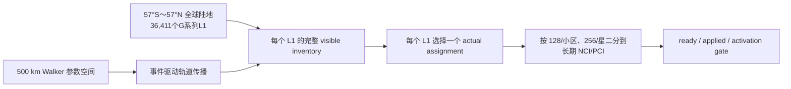
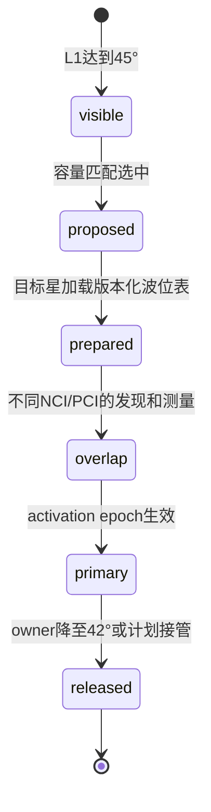

# ±57°全球陆地卫星轨道搜索与可视化方案

> 最终工程方案采用 46 个轨道面、每面 65 颗，共 2,990 颗卫星；网页中的 42 面、3,528 颗仅作为历史展示对照。轨道传播、星座搜索与全球 ownership 仍属于管理中心/Web 离线规划，不复制进 CU-CP。管理中心 exporter 与 CU-CP 已通过 schema v3 同时传递完整可见清单和实际负责子集。`selectedScenario=null`、`exact=false` 继续表示 7 天连续覆盖、故障和真实无线验收尚未完成，不再表示卫星数量没有结论。

配套波位目录、小区身份和容量边界见 [全球陆地星载双小区与波位规划](./ntn_beam_constellation_plan.md)。

## 1. 一句话方案

在南纬 `57°` 至北纬 `57°` 的全球陆地区域使用已生成的地固 `G######` / `G######-n` 波位，以 500 km 单壳层 Walker 星座做参数搜索；轨道只决定每个时刻哪些卫星可见、哪个 assignment proposal 可行，NCI/PCI 始终属于每颗卫星上的两个长期 NR 小区。

## 2. 服务范围与系统边界

### 2.1 纳入规划

- 纬度闭区间 `[-57°, +57°]` 内、Natural Earth 1:50m 中心点判定为陆地的 Web 目录。
- 地固 L1/L2 的 ID、中心点、几何和邻接；跨星服务时这些属性不变。
- 每个 L1 的完整 `visible inventory`、容量受限 assignment proposal、星上双小区二分和接管准备。

### 2.2 暂不纳入连续服务验收

- 海洋、南北纬 57° 以外区域，以及正式运营 GIS 尚未冻结的海岸/国界 guard 区。
- 真实 gateway/feeder 可见性、链路预算、频率许可、星间链路、碰撞规避和发射批次。
- SGP4/J2 长期漂移、真实 TLE 误差、Doppler、TA、HARQ、功率和射频切换执行。

### 2.3 软件边界

管理中心负责星历、全球波位表、NCI registry、PCI 冲突图、assignment proposal、版本和 activation epoch；星载 CU-CP 不运行全球选星。schema v3 使用 `visible_l1_positions` 传递本星完整可见清单，使用 `assigned_l1_position_ids` 传递实际负责子集。CU-CP 完整保存前者，只把后者划入两个长期小区并生成接入日历。本轮没有修改 F1AP、DU、MAC、PHY、RU/RF 或 generated ASN.1；Web 仍只展示搜索和离线规划状态。

## 3. 最终方案与历史展示对照

最终方案采用 2,990 颗卫星，比 3,528 颗历史展示对照少 `538` 颗，即减少 `15.25%`。两组离线结果仍须使用同一目录、epoch、传播器和验收字段比较；对比结果用于解释设计依据，不再用于决定卫星数量。

| 参数 | 历史展示对照 | 最终采用方案 | 说明 |
|---|---:|---:|---|
| 轨道面数 | `42` | `46` | 最终采用 46 个轨道面 |
| 每面卫星 | `84` | `65` | 分别为 `42×84` 和 `46×65` |
| 卫星总数 | `3,528` | `2,990` | 最终方案少 `538` 颗（`15.25%`） |
| 倾角 | `60°` | `60°` | 最终方案当前采用值 |
| 轨道高度 | `500 km` | `500 km` | 二体圆轨道传播参数 |
| Walker 相位参数 | `1` | `33` | 仅保留为技术输入，不作为面向读者的结论名称 |
| 公共 epoch | 待冻结 | 待冻结 | 所有对比场景必须使用同一 epoch |
| 新选 / 退出仰角 | `45° / 42°` | `45° / 42°` | 形成 3° ownership 滞回 |
| 服务 mask | `57°S～57°N` 全球陆地 | 同左 | Web 目录 36,411 L1；正式运营 GIS 尚未冻结 |

500 km 下，`45°` 和 `42°` 的球面覆盖半径约为 `448 km` 和 `494 km`。这些数值只用于几何初筛，不等于链路可用半径。

### 3.1 卫星与星载小区身份

- 当前 42×84 registry 的规划短号为 `P01-S01`～`P42-S84`，仅对应历史展示对照。最终 2,990 颗方案必须生成与 46×65 场景精确匹配的新 registry，不能复用或按序号推导现有身份。CU-CP 只做 opaque exact-match，短号、轨道面、槽位和 epoch 是独立属性。
- 每颗卫星运行两个长期星载 NR 小区。NCI 由中心 registry 分配，在 PLMN 内唯一；NCGI 由 PLMN identity 与 NCI 组合后全球唯一。
- 3,528 颗历史对照包含 7,056 个 NCI；2,990 颗最终方案需要 5,980 个 NCI。NCI 不从卫星短号、波位 ID 或坐标推导。
- PCI 不是全球唯一。把同时可见且同频的两个星载小区连接为冲突边，对动态时间并集图做可复用规划；PCI 不随每次跳波束访问改变。

## 4. 完整可见清单与实际唯一分配必须分开

这张图表示管理中心与星载 CU-CP 的职责分工。管理中心 exporter 已将 `VISIBLE`
与 `MATCH` 的结果原子写入 schema v3；CU-CP 保存完整可见清单，并从实际负责子集开始执行 `SPLIT`、日历检查和启用控制。

1. 新候选在 L1 处达到 `45°` 后进入 `visible inventory`。
2. 当前 owner 可滞回保持到 `42°`；低于 42° 才退出。
3. `visible inventory` 保存每个 L1 的所有几何可见候选，不受每星 256、每小区 128、active 或 loaded 上限裁剪；它不是“最终选中的卫星清单”。
4. actual assignment 在完整清单之上为每个 L1 选择且只选择一个负责卫星，再分给该星的两个长期小区。每星 256、每小区 128 只限制这份实际负责的一级波位，不是波束数量，也不得用于裁剪完整可见清单。
5. 容量、端口、gateway 和迁移成本只影响 assignment proposal，不得反向删除可见候选。几何采样通过也不等于唯一分配已经通过。
6. proposal 不是 serving。只有目标 ready、DU `applied` 且到达对齐 640 ms 的 activation epoch 后，才能提交 actual owner。

## 5. 星载双小区与接管

每星两个长期小区各有 `16 analog / 64 digital` 规划资源，整星为 `32/128`，暂不互借。当前 Web 日历以 4×2.5 ms sub-visit 得到最差 80 ms 窗口 168 次机会，并把 actual assignment 的配置上限设为 128 L1/小区、256 L1/星。这里的 128/256 是实际负责 L1 的离散日历/CU-CP 执行包络，不是可见候选数、模拟或数字波束数，也不是 PHY/RU/RF 或协议保证。CU-CP 已将 schema v3 的负责子集二分给两个长期小区，并为每个已分配 L1 安排 SSB 与 PRACH 机会；完整可见清单可以超过 256 条且保持不变。负载均衡、空间紧凑、连通和 UE sticky 是划分优化目标，不是全球连续覆盖结论。

跨星时不迁移 NCI。源、目标分别使用自己的星载 NCI/PCI；同一 L1 在一个 activation epoch 最多一个 primary。目标可以为发现和测量预热，但不能在 ready/applied 前被称为 serving。

## 6. 当前离散证据与精确审计缺口

当前针对 46×65、2,990 颗最终方案的证据必须按验证层次分别阅读：

| 验证层次 | 采样范围 | 当前结果 | 能证明什么 / 不能证明什么 |
|---|---:|---|---|
| 一天完整可见清单 | 每 `120 s`，共 `720` 个采样点 | `coverage=true`，最大未覆盖 L1 为 `0`，最少 entry 候选为 `2`；release-visible 峰值 `254 L1/星`，entry-visible 峰值 `209 L1/星` | 证明 720 个采样点的几何候选完整；可见峰值不是实际负责量，也不证明采样间连续覆盖 |
| 一天逐点唯一分配 | 同一组 `720` 个采样点 | `assignment=true`、`conclusive=720/720`；实际负责峰值 `87 L1/星`，平衡双小区后的峰值 `44 L1/小区`，overflow 为 `0` | 证明每个采样点都能给每个 L1 唯一分配一个负责方且满足 256/128 上限；不证明采样间连续可分配 |
| 事件驱动精确审计 | 至少连续 `7` 天 | 尚未完成 | `exact=false`，不能证明全球连续覆盖；它属于上线验收，不再用于决定卫星数量 |

这 720 个点仍是固定步长证据。目录内容 hash 已由工具重新计算并与 manifest 绑定，但公共 epoch 和绝对 RAAN 相位尚未冻结，因此结果只对当前模型 `t=0` 有效。最终方案仍需至少连续 7 天的事件驱动验收：传播器精确定位仰角穿越、容量饱和、owner 释放、gateway 变化和接管窗口，再在事件之间验证不变量。早期 42×84 场景的一个 phase 参数组合曾在 `t=0` 出现 23 个空窗，只能排除该具体组合，不能据此把 3,528 颗规模本身写成通过或失败。

每个搜索场景至少输出：

| 指标 | 目的 |
|---|---|
| `zero_visible_interval` | 任一 service L1 是否出现无 45° 候选区间 |
| `minimum_visible_count` | 完整 visible inventory 的最小候选数 |
| `assignment_failure_interval` | 有候选但受局部容量约束无法分配的区间 |
| `assigned_l1_per_satellite` | actual assignment 是否超过每星 256；不统计完整可见清单 |
| `assigned_l1_per_nci` | actual assignment 是否超过每小区 128；不代表波束数量 |
| `ownership_change_event` | 加入滞回、冻结和切换代价后的真实 proposal 变化 |
| `pci_conflict_interval` | 同频、同时可见星载小区是否复用同 PCI |
| `n_minus_one_failure` | 单星/单面失效后的局部服务缺口 |
| `ssb_deadline_miss` | 80 ms L1 SSB 重访是否失败 |
| `prach_deadline_miss` | 每个已分配 L1 的 640 ms PRACH 重访是否失败 |

审计必须保存场景参数、代码/数据版本、事件时间、失败 L1、完整候选集合、卫星负载、NCI/PCI 和触发约束。没有这份报告，就不能把 seed 写成“已通过”。

### 6.1 设计决定与验收记录

- 工程决定采用 2,990 颗卫星；网页 3,528 颗模型仅保留为历史展示对照。
- 当前 `selectedScenario=null`、`exact=false` 是原审计记录的正式验收状态。它们在完成 7 天连续验收前保持不变，但不再表示工程数量尚未决定。
- 2,990 颗方案的一天 720 个采样点已同时得到 `coverage=true` 和 `assignment=true`；它仍是有界离散证据，不能标为 `exact_pass` 或“全球连续覆盖通过”。
- 报告中的 720/720 assignment pass 只能表述为“逐采样点唯一分配通过”，不得改写成采样间连续覆盖或连续 ownership 通过。
- 至少比较面数、每面星数、倾角、Walker 相位参数、RAAN/相位偏置、每星降额容量和 N-1。
- 搜索结果不保证随卫星总数单调改善；必须用同一 mask、epoch 和事件模型比较。
- 只有完整 7 天报告满足冻结的验收门限后，审计记录才能填写 `selectedScenario`。

## 7. Web 展示要求

- 3D 地球暂时显示 42×84、3,528 颗历史模型时，必须显著标注“历史展示对照”，不得称为当前或最终方案。
- 结论区必须明确写明“最终采用 46×65、2,990 颗”，并显示比历史对照少 538 颗（15.25%）。同时说明 `selectedScenario=null`、`exact=false` 对应上线验收尚未完成。
- 2D 地图使用已生成的 `G######` / `G######-n` Web 目录；正式运营 GIS 冻结仍需单独评审。
- 轨道、时间、卫星、NCI/PCI、L1/L2、visible inventory 和端口日历共享选择状态。
- 选择 L1 时先显示完整 visible inventory，再单独显示 actual assignment；不能只展示被选中的服务星，也不能用 128/256 裁剪候选清单。
- 分开展示“一天 720/720 个几何采样通过”和“一天 720/720 个逐点 unique assignment 通过”，并同时展示 `exact=false`；不得用绿色 PASS 暗示任何候选已经连续验收。
- WebGL 不可用时回退到地面轨迹、候选表和审计状态表。

当前 Web 已加载 [`global-land-l1-v1.json`](../web_replicas/ntn_beam_planner/public/data/global-land-l1-v1.json)，生成器与 `--check` 位于 [`generate-global-land-catalog.mjs`](../web_replicas/ntn_beam_planner/scripts/generate-global-land-catalog.mjs)。目录来自本地 Natural Earth 4.1.0 / `world-atlas@2.0.2` 1:50m land，包含 36,411 L1、249,375 有效 L2、33,871 full 和 2,540 edge；cells SHA-256 为 `b39fe9c3ee9a9355b3546036b7f16e0fb858c953f8558cc4295122f2169fbe7a`。

该目录由 244 个等 `sin(latitude)` 带生成，目标单元面积 `3,117.691454 km²`，最大面积偏差 `0.1115%`。它是球面等面积 quasi-hex 中心格：`exactRegularSphericalHexagons=false`、`exactCoastlineClipping=false`，不能表述成严格正球面六边形或精确海岸裁剪。

## 8. 状态与证据

统一使用四级状态：

- `规划中`：只有目标、seed 或待审计约束。
- `已实现`：工作区存在实现或可执行入口，但本项未引用通过的测试。
- `已有测试覆盖`：存在 focused 测试资产；不等于全球方案已经验收。
- `已有离线规划证据`：管理中心工具生成了可复现报告；它不是 C++ 基站运行、
  RF 或空口证据。
- `已有运行态证据`：有明确范围的 C++ 运行日志或 pcap；不得扩大解释。

| 能力 | 状态 | 当前证据边界 |
|---|---|---|
| 500 km 二体圆轨道与旧中国 Web 展示 | 已有测试覆盖 | 只覆盖旧参数化模型和历史样例 |
| 3,528 颗历史展示对照 | 已实现 | 只用于现有 Web 互动展示，不再作为目标规模 |
| 2,990 颗最终方案的一天 unique assignment | 已有离线规划证据 | 已采用为最终工程方案；目录内容 hash 已重新校验，120 s 的 720/720 离散时刻通过，实际分配峰值 87/星、平衡双小区峰值 44、小区/卫星 overflow 0；公共 epoch 未冻结，不是连续证明或 C++ 运行态证据 |
| 完整可见清单 + 实际负责子集输入 | 已有测试覆盖 | schema v3 原子携带 `visible_l1_positions` 与 `assigned_l1_position_ids`；CU-CP 只对负责子集执行 256/128 容量检查、双小区划分和日历，v1/v2 按 `assigned=visible` 兼容 |
| 全球目录生成器、asset 与 loader | 已实现 | Web 已加载 36,411 L1 / 249,375 L2；不是 CU-CP 运行态 |
| 全球目录确定性与几何约束 | 已有测试覆盖 | `catalog:check` 和 focused tests `6/6` 通过；不是正式运营 GIS 验收 |
| 2,990 星一天 coarse visible inventory | 已有离线规划证据 | 120 s 的 720/720 几何采样通过；最少 entry 候选 2，release/entry-visible 峰值 254/209；采样间可能有空洞 |
| 全球 PCI 冲突图 | 规划中 | 算法和验收字段待实现/运行 |
| 7 天事件驱动、N-1 与 PHY/RU/RF | 规划中 | 无可引用的真实报告 |

## 9. 历史中国样例

旧 `Walker Delta 53°:720/30/1`、大陆及海南 2,620 个 L1、`25°/22°` 旧门限、每星 84 容量和 24 小时/120 s 采样结果保留用于回归与解释演进。历史样例中的 `720/720`、PCI 一跳代理和 owner diff 都不能外推到全球，也不能替代事件驱动 handover 或连续时间 RF 证明。

## 10. 下一步

1. 保留当前 Web 目录作为可重复仿真输入，另行冻结正式运营 GIS、海岸精确裁剪和国界 guard。
2. 保留 2,990 颗最终方案一天 120 s、720 点的几何与唯一分配报告，并把两类指标分开展示。
3. 冻结公共 epoch 与绝对轨道相位，实现参数化 Walker 事件检测，生成至少 7 天精确报告。
4. 使用 2,990 颗最终方案匹配的身份 registry 生成正式 schema v3 下发包，并保持可见清单、负责子集、版本和启用时刻一致。
5. 对 actual assignment 加入 gateway、N-1、接管代价及 256/128 降额敏感性扫描，不裁剪完整可见清单。
6. 构建同时可见、同频星载小区冲突图并验证 1,008 个 PCI 的复用可行性。
7. 7 天验收通过后更新 `selectedScenario` 审计记录；CU-CP 不自行选择星座。

schema v3 的收敛限于管理中心计划输入、CU-CP 处理、恢复和只读状态，不修改 F1AP、DU、MAC、PHY、RU/RF、Web/GIS 或 generated ASN.1。软件日历仍不等于真实天线和空口执行。
